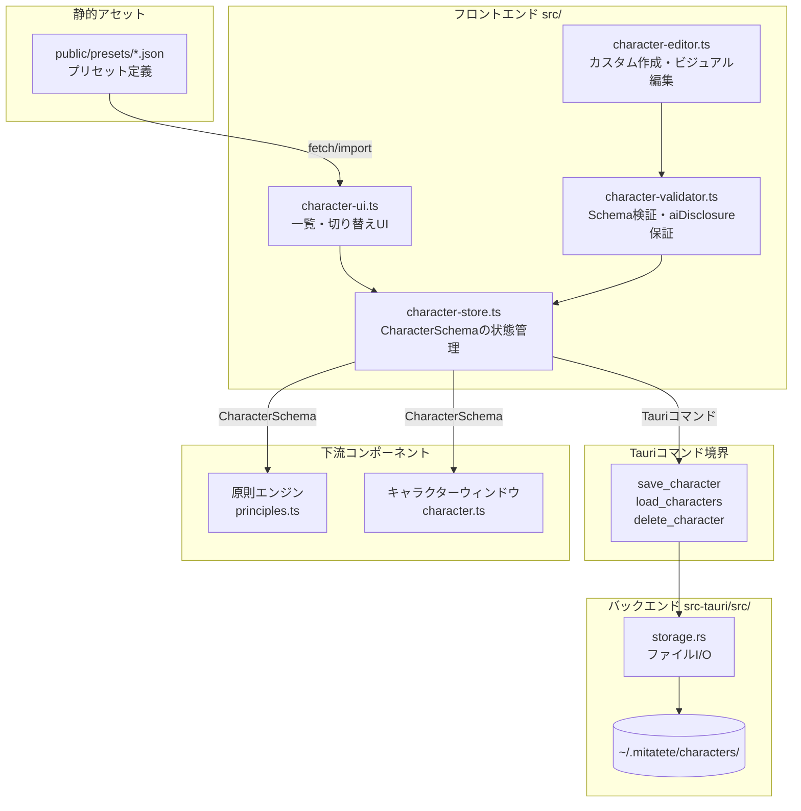
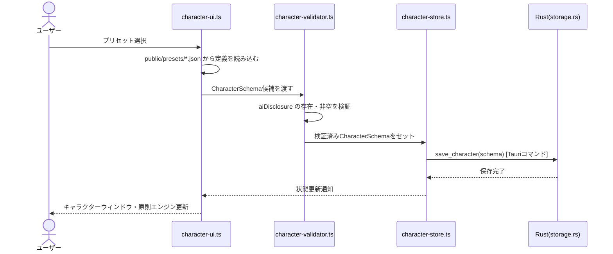
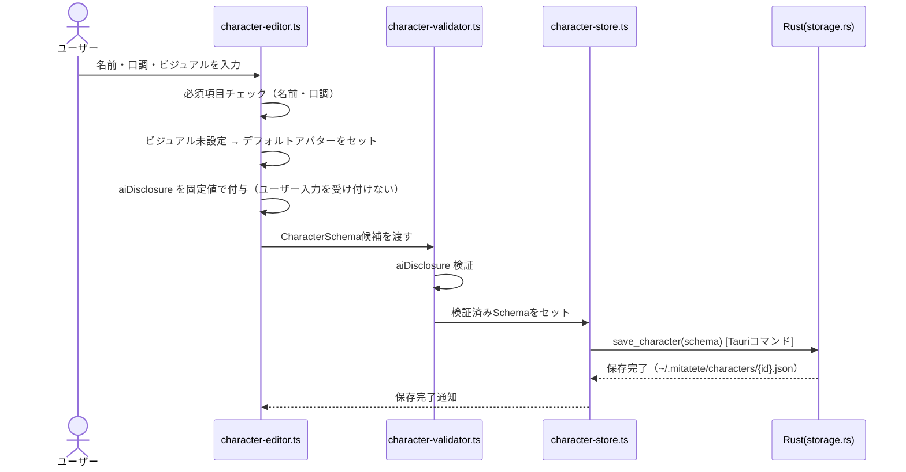
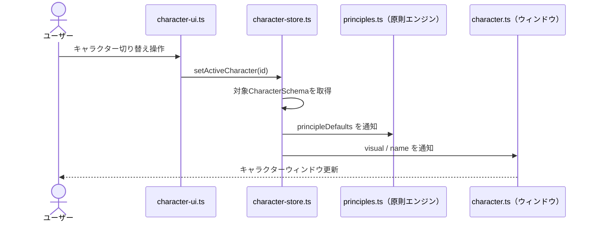

# 設計書

## 概要

character-layer は、Mitatete の全コンポーネントに対してキャラクター情報を一元供給するレイヤーである。プリセット（`public/presets/*.json`）とカスタム（`~/.mitatete/characters/`）の2つの入力源を、共通インターフェース `CharacterSchema` に統一変換し、原則エンジン・チャットUI・キャラクターウィンドウへ渡す。

ユーザーはキャラクターを自分で選ぶ。システムは自動選択・自動切り替えを一切行わない（tech.md「設計上の制約」、structure.md「設計上の不変条件」）。原則8（`aiDisclosure`）はシステムが固定値で付与し、ユーザー編集を受け付けない。

**ユーザー：** Mitateteを使うデスクトップユーザーが、キャラクター選択・作成・切り替えのワークフローで利用する。

**影響：** character-layer は他の全specが依存する最上流コンポーネントであり（structure.md「コンポーネント責務と依存方向」）、`CharacterSchema` の構造変更は model-router・diary-engine の再検証を必要とする。

### ゴール

- プリセット・カスタムを問わず `CharacterSchema` に変換する統一インターフェースの確立
- 原則8（`aiDisclosure`）の不変性保証
- Rustバックエンド経由によるローカルファイル永続化（Tauri方針）
- フェーズ2：レイヤー構造ビジュアルエディターと著作権同意フローの実現

### 非ゴール

- 原則エンジンの7軸調整ロジック（model-router spec が担う）
- チャットUI・対話履歴管理
- Googleドライブ同期（storage-manager spec が担う）
- AI モデルへのAPI呼び出し
- ユーザーデータ分析に基づくキャラクター自動選択・自動変更

## 境界コミットメント

### 本Specが担う

- `CharacterSchema` 型の定義と生成ロジック
- プリセットキャラクター定義の読み込み・パース
- カスタムキャラクターの作成・編集・削除フロー（UI含む）
- `aiDisclosure` フィールドの固定付与と編集不可制御
- キャラクター切り替え時の `principleDefaults` を原則エンジンへ通知する責務
- ローカルファイルへの保存・読み込みのTauriコマンド呼び出し（I/O実装はRust側）
- フェーズ2：`VisualConfig` 型定義・SVGビジュアルエディター・著作権同意フロー

### 境界外

- `~/.mitatete/characters/` ファイルの物理的I/O実装（storage-manager / Rustバックエンドが担う）
- プロンプト構築・モデル呼び出し（model-router が担う）
- 日記エンジンへの入力（diary-engine が担う）
- APIキー管理・セキュアストレージ

### 許可される依存

- Rustバックエンド（`src-tauri/src/storage.rs`）のTauriコマンド：`save_character`・`load_characters`・`delete_character`
- `public/presets/*.json`：プリセット定義の静的ファイル
- ローカルファイルシステム（常時利用可）：Googleドライブ承認状態に依存しない

### 再検証トリガー

- `CharacterSchema` のフィールド追加・削除・型変更 → model-router・diary-engine の再確認が必要
- `aiDisclosure` の固定文言変更 → 全specに影響（原則8の核心）
- Tauriコマンド名変更 → フロントエンドのコマンド呼び出し箇所を更新

## アーキテクチャ

### アーキテクチャパターンと境界マップ

character-layer は **フロントエンド管理レイヤー** として、Tauri コマンドを境界に Rust バックエンドと通信する。



- **選択パターン：** シンプルな状態管理（TypeScript・フレームワークなし）。`character-store.ts` が唯一の `CharacterSchema` 権威ソースとなる。
- **Tauri コマンド境界：** フロントエンドからファイルシステムへの直接アクセスを禁止し、全I/OをRustコマンド経由に限定（structure.md「レイヤー境界」）。
- **不変条件の施行：** `character-validator.ts` が `aiDisclosure` の存在・非空を検証してから `character-store.ts` へ渡す。

### テクノロジースタック

| レイヤー       | 採用技術                                       | 本featureでの役割                                              | 備考                                                              |
| -------------- | ---------------------------------------------- | -------------------------------------------------------------- | ----------------------------------------------------------------- |
| フロントエンド | TypeScript 7 + Vite（Viteが JS へビルド・HMR） | キャラクター選択UI・カスタム作成フォーム・ビジュアルエディター | vanilla・フレームワークなし。ソースは `.ts`、配信は JS（tech.md） |
| Tauriコマンド  | Tauri v2 invoke                                | フロントエンド↔Rustの通信境界                                  |                                                                   |
| バックエンド   | Rust（storage.rs）                             | キャラクターJSON の読み書き・削除                              | フロントエンドからのファイル直接アクセスを禁止                    |
| ストレージ     | ローカルファイルシステム                       | `~/.mitatete/characters/*.json` に永続化                       | 常時利用可・GDrive依存なし                                        |
| 静的アセット   | JSON                                           | `public/presets/*.json`（プリセット定義）                      | 実行時アセット（public/ 経由で配信）                              |

## ファイル構成計画

### ディレクトリ構造

```
src/
├── character-store.ts         # CharacterSchemaの状態管理（唯一の権威ソース）
├── character-ui.ts            # キャラクター一覧・選択・切り替えUI
├── character-editor.ts        # カスタムキャラクター作成・編集フォーム
├── character-validator.ts     # Schema検証・aiDisclosure不変性保証
├── character-visual-editor.ts # [フェーズ2] SVGビジュアルエディター
└── styles.css                 # フロントエンド共通スタイル

public/presets/
├── preset-a.json              # プリセットキャラクター定義
└── preset-b.json

src-tauri/src/
└── storage.rs                 # save_character / load_characters / delete_character コマンド実装
```

### 変更対象ファイル

- `src-tauri/src/storage.rs` — キャラクター用Tauriコマンドの追加（save/load/delete）
- `src-tauri/tauri.conf.json` — コマンド権限の追加

## システムフロー

### フロー 1：プリセット選択



### フロー 2：カスタムキャラクター作成



### フロー 3：キャラクター切り替え



> フローの要点：キャラクター切り替えはユーザーの明示的操作のみで発生する。`character-store.ts` が自律的にアクティブキャラクターを変更するロジックを持たない。

## 要件トレーサビリティ

| 要件ID  | 概要                              | コンポーネント                              | インターフェース                   | フロー      |
| ------- | --------------------------------- | ------------------------------------------- | ---------------------------------- | ----------- |
| 1.1–1.5 | プリセット選択・読み込み          | character-ui.ts, character-validator.ts     | CharacterSchema                    | フロー1     |
| 2.1–2.5 | カスタムキャラクター作成          | character-editor.ts, character-validator.ts | CharacterSchema, Tauriコマンド     | フロー2     |
| 3.1–3.3 | 原則8の不変性                     | character-validator.ts, character-store.ts  | aiDisclosureフィールド             | フロー1,2,3 |
| 4.1–4.4 | キャラクター切り替え              | character-ui.ts, character-store.ts         | CharacterSchema, principleDefaults | フロー3     |
| 5.1–5.4 | 永続化                            | character-store.ts, storage.rs              | Tauriコマンド                      | フロー1,2   |
| 6.1–6.5 | ビジュアルエディター（フェーズ2） | character-visual-editor.ts                  | VisualConfig                       | —           |

## コンポーネントとインターフェース

### コンポーネント概要

| コンポーネント             | レイヤー                        | 責務                                      | 要件対応 | 主要依存                              |
| -------------------------- | ------------------------------- | ----------------------------------------- | -------- | ------------------------------------- |
| character-store.ts         | フロントエンド・状態管理        | CharacterSchemaの権威ソース・切り替え管理 | 3, 4, 5  | character-validator.ts, Tauriコマンド |
| character-ui.ts            | フロントエンド・UI              | 一覧表示・プリセット選択・切り替えUI      | 1, 4     | character-store.ts                    |
| character-editor.ts        | フロントエンド・UI              | カスタム作成・編集フォーム                | 2        | character-validator.ts                |
| character-validator.ts     | フロントエンド・ロジック        | Schema検証・aiDisclosure不変性            | 3        | —                                     |
| character-visual-editor.ts | フロントエンド・UI（フェーズ2） | SVGビジュアルエディター・著作権同意       | 6        | character-editor.ts                   |
| storage.rs（Rustコマンド） | バックエンド                    | ファイルI/O（キャラクターJSON）           | 2, 5     | ローカルFS                            |

### フロントエンド・状態管理レイヤー

#### character-store.ts

| フィールド | 詳細                                                                                         |
| ---------- | -------------------------------------------------------------------------------------------- |
| 責務       | `CharacterSchema` の唯一の権威ソース。アクティブキャラクターの保持・通知・切り替えを管理する |
| 要件       | 3.1, 3.3, 4.1, 4.2, 4.3, 5.1, 5.2, 5.3, 5.4                                                  |

**責務と制約**

- アクティブキャラクターの `CharacterSchema` を保持し、原則エンジン・キャラクターウィンドウへ通知する
- `setActiveCharacter()` は必ずユーザー操作起点から呼ばれる。内部タイマー・AIレスポンスからの呼び出しを禁止する
- 保存・読み込みは Tauri コマンド経由のみ

**サービスインターフェース（TypeScript モジュール）**

```typescript
// character-store.ts
const CharacterStore = {
  // 起動時にローカルファイルから復元
  async init(): Promise<void>,

  // アクティブキャラクターを取得
  getActive(): CharacterSchema | null,

  // 全キャラクター（プリセット+カスタム）一覧を取得
  getAll(): CharacterSchema[],

  // キャラクターを切り替える（ユーザー操作からのみ呼ぶ）
  async setActive(id: string): Promise<void>,

  // カスタムキャラクターを保存
  async save(schema: CharacterSchema): Promise<void>,

  // カスタムキャラクターを削除
  async delete(id: string): Promise<void>,

  // 変更を購読（原則エンジン・CW が使用）
  subscribe(listener: (schema: CharacterSchema) => void): () => void,
};
```

**不変条件**

- `getActive()` が返す `CharacterSchema.aiDisclosure` は常に非空文字列である
- `setActive()` の呼び出し元は必ずユーザーUI操作（クリック等）でなければならない

#### character-validator.ts

| フィールド | 詳細                                                                 |
| ---------- | -------------------------------------------------------------------- |
| 責務       | `CharacterSchema` の必須フィールド検証と `aiDisclosure` の不変性保証 |
| 要件       | 3.1, 3.2, 3.3                                                        |

**サービスインターフェース**

```typescript
// character-validator.ts
const CharacterValidator = {
  // スキーマを検証し、aiDisclosureを強制付与して返す
  // 検証失敗時はエラーをスローする
  validate(candidate: Partial<CharacterSchema>): CharacterSchema,

  // aiDisclosure の固定文言
  AI_DISCLOSURE: "私はAIアシスタントです。人間ではありません。",
};
```

- **前提条件：** `candidate.name` と `candidate.tone` が非空文字列であること
- **事後条件：** 返り値の `aiDisclosure` は `AI_DISCLOSURE` と同一であること
- **不変条件：** `aiDisclosure` はいかなる引数でも上書きできない

### バックエンドレイヤー

#### storage.rs（Tauriコマンド）

| フィールド | 詳細                                                                       |
| ---------- | -------------------------------------------------------------------------- |
| 責務       | キャラクターJSONの読み書き・削除。`~/.mitatete/characters/` 配下を管理する |
| 要件       | 2.5, 5.1, 5.2, 5.3                                                         |

**Tauriコマンドインターフェース（Rust→フロントエンド）**

```rust
// src-tauri/src/storage.rs に追加するコマンド

#[tauri::command]
async fn save_character(schema_json: String) -> Result<(), String>

#[tauri::command]
async fn load_characters() -> Result<Vec<String>, String>
// 戻り値: CharacterSchema の JSON 文字列配列

#[tauri::command]
async fn delete_character(id: String) -> Result<(), String>
```

- **保存先：** `~/.mitatete/characters/{id}.json`
- **エラー処理：** ファイルI/Oエラーは `Err(String)` として返し、フロントエンドでユーザーに通知する
- **冪等性：** `save_character` は同一IDで呼ばれた場合、既存ファイルを上書きする

## データモデル

### ドメインモデル

`CharacterSchema` はcharacter-layer が生成・管理する唯一のエンティティである。プリセット・カスタムの区別は `isPreset` フラグで表現し、外部インターフェースは統一する。

### 論理データモデル

**CharacterSchema（全コンポーネント共通インターフェース）**

```typescript
interface CharacterSchema {
  id: string; // UUID v4
  name: string; // 固有性：名前（非空文字列）
  visual: string; // 固有性：ビジュアル（画像URLまたはbase64）
  tone: string; // 固有性：口調定義テキスト（非空文字列）
  aiDisclosure: string; // 固定（原則8）：「私はAIアシスタントです。人間ではありません。」
  principleDefaults: {
    // 7原則の初期強度値（1〜5）
    固有性を与える: number;
    信頼から始める: number;
    一貫性を守る: number;
    余白を持つ: number;
    距離感を大切にする: number;
    行動で示す: number;
    多様な向き合い方を認める: number;
  };
  diaryEnabled: boolean; // 原則9のON/OFF初期値
  isPreset: boolean; // プリセット：true / カスタム：false
  visualConfig?: VisualConfig; // フェーズ2（オプション）
}
```

**VisualConfig（フェーズ2）**

```typescript
interface VisualConfig {
  mode: "template" | "upload";
  templateParams?: {
    bodyType: "human" | "animal" | "thing" | "abstract";
    eyeShape: "round" | "narrow" | "star" | "dot";
    hairStyle: "short" | "long" | "bun" | "none" | "ears";
    outfitColor: string; // hex (#RRGGBB)
    skinColor: string; // hex (#RRGGBB)
  };
  uploadedImagePath?: string; // ローカルファイルパス（mode='upload'の場合）
}
```

### 物理データモデル

**プリセット定義（`public/presets/*.json`）**

```json
{
  "id": "preset-a",
  "name": "アシスタントA",
  "visual": "presets/images/preset-a.png",
  "tone": "丁寧で落ち着いた口調で話します。",
  "aiDisclosure": "私はAIアシスタントです。人間ではありません。",
  "principleDefaults": {
    "固有性を与える": 3,
    "信頼から始める": 4,
    "一貫性を守る": 4,
    "余白を持つ": 3,
    "距離感を大切にする": 3,
    "行動で示す": 3,
    "多様な向き合い方を認める": 3
  },
  "diaryEnabled": false,
  "isPreset": true
}
```

**カスタムキャラクター（`~/.mitatete/characters/{id}.json`）**

- 構造は `CharacterSchema` と同一
- `isPreset: false`
- `id` はUUID v4

## エラーハンドリング

### エラー戦略

ファイルI/Oエラーはユーザーに通知し、アプリを継続動作させる（縮退動作優先）。

### エラーカテゴリと対応

| エラー種別                       | 原因                                 | 対応                                                                |
| -------------------------------- | ------------------------------------ | ------------------------------------------------------------------- |
| プリセット定義ファイル不在       | `public/presets/*.json` が存在しない | エラー通知・プリセットなしで継続                                    |
| カスタムキャラクター保存失敗     | ディスク容量不足・権限エラー         | エラーメッセージ表示・保存失敗を通知                                |
| カスタムキャラクター読み込み失敗 | ファイル破損・不在                   | デフォルトキャラクターにフォールバック                              |
| `aiDisclosure` 検証失敗          | 不正なSchema候補                     | `character-validator.ts` が例外をスローし、UIが入力エラーとして表示 |
| ビジュアル未設定                 | 画像未アップロード                   | デフォルトアバター（内蔵SVG）を自動適用                             |

### 監視

- エラーは `console.error` で記録する（フェーズ1）
- フェーズ2以降でログファイルへの永続化を検討する

## テスト戦略

### ユニットテスト

1. `character-validator.ts`：`aiDisclosure` の強制付与・非空検証・必須フィールド欠損時のエラー
2. `character-store.ts`：`setActive()` が正しく `CharacterSchema` を更新するか・購読通知が正しく発火するか
3. `CharacterSchema` のJSON直列化・逆直列化の整合性

### 統合テスト

1. プリセット選択 → `CharacterSchema` 生成 → `principleDefaults` が原則エンジンに反映されるまでの一連フロー
2. カスタム作成 → Tauriコマンド経由保存 → アプリ再起動後に読み込みが復元されること
3. ビジュアル未設定時のデフォルトアバターフォールバック確認

### E2Eテスト

1. ユーザーがプリセットを選択してからキャラクターウィンドウのビジュアルが更新されること
2. カスタムキャラクター作成・保存・一覧表示・削除の完全ワークフロー
3. フェーズ2：画像アップロード時の著作権同意フロー

## セキュリティ考慮事項

- キャラクター定義ファイルにAPIキーを含めない（APIキーは `key_manager.rs` が独立管理する）
- アップロード画像はローカルファイルパスでのみ参照し、base64エンコードでのネットワーク送信を行わない
- `aiDisclosure` フィールドはフロントエンドのフォームバリデーションとサーバーサイド（Rust）双方で編集不可を強制する（将来のマルチウィンドウ攻撃対策）
