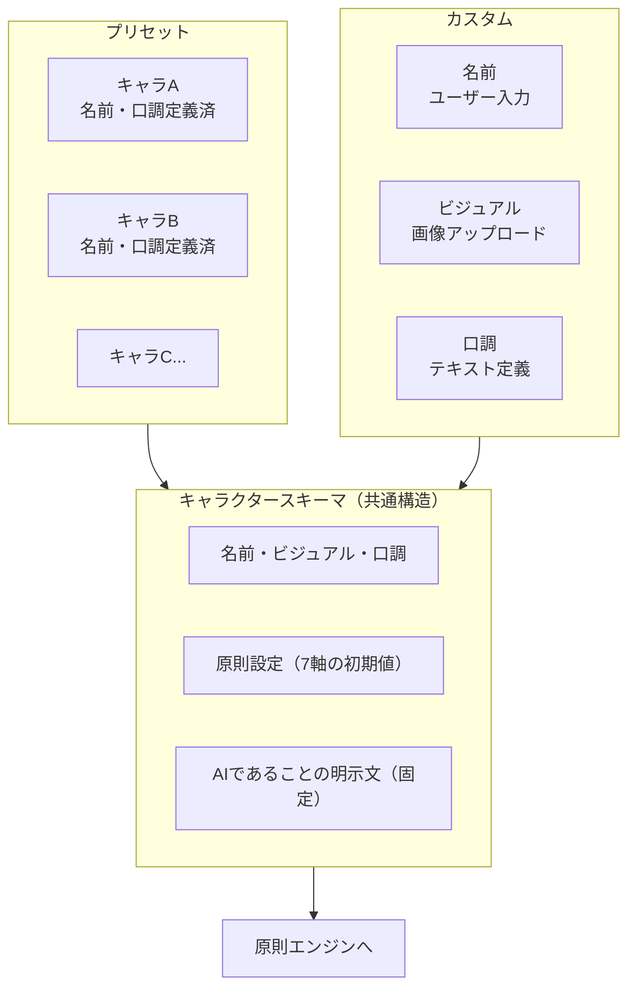

# spec: character-layer

## 概要

プリセットおよびカスタムキャラクターを管理し、共通のキャラクタースキーマに変換して原則エンジンへ渡すコンポーネント。



## 要件（EARS形式）

- WHEN ユーザーがプリセットキャラクターを選択する THEN システムはそのキャラクターの名前・ビジュアル・口調を読み込み、キャラクタースキーマを生成する
- WHEN ユーザーがカスタムキャラクターを作成する THEN システムは名前（テキスト）・ビジュアル（画像）・口調（テキスト）の入力を受け付け、キャラクタースキーマを生成する
- WHERE キャラクタースキーマが生成される THEN 原則8「AIであることを明示する文」が必ず含まれる
- IF カスタムキャラクターのビジュアルが未設定の場合 THEN デフォルトアバターを使用する
- WHEN キャラクターが切り替えられる THEN 原則エンジンの設定値をそのキャラクターの初期値に更新する

## キャラクタースキーマ（共通データ構造）

```typescript
interface CharacterSchema {
  id: string;
  name: string;                    // 固有性：名前
  visual: string;                  // 固有性：ビジュアル（画像URL or base64）
  tone: string;                    // 固有性：口調定義テキスト
  aiDisclosure: string;            // 固定：「私はAIアシスタントです」系の文言
  principleDefaults: {             // 7原則の初期強度値
    固有性を与える: number;          // 1〜5
    信頼から始める: number;
    一貫性を守る: number;
    余白を持つ: number;
    距離感を大切にする: number;
    行動で示す: number;
    多様な向き合い方を認める: number;
  };
  diaryEnabled: boolean;           // 原則9のON/OFF初期値
  isPreset: boolean;
}
```

## テンプレートとカスタマイズ設計（フェーズ2・コア完成後）

> **実装優先度：低。コア機能（チャット・原則エンジン・モデルルーター・日記・ストレージ）が完成した後に着手する。**

### 基本方針

- Mitateteが提供するオリジナルテンプレートをベースに、ユーザーがカスタマイズして自分のキャラクターを作る
- 既存IPや商標キャラクターに似せた造形・画像は許容しない
- カスタマイズはレイヤー構造で行い、組み合わせの自由度を確保する

### レイヤー構造

| レイヤー | 選択肢 | 備考 |
|---------|--------|------|
| 体型 | 人物・動物・モノ・抽象 | ベースの体型を決定 |
| 目の形 | まるい・細め・星形・点 | 普遍的な幾何学形のみ |
| 髪・頭 | ショート・ロング・まとめ髪・なし・動物耳 | |
| 服の色 | 8色以上のプリセット | カスタムカラー入力も可 |
| 肌・ベースカラー | 8色以上のプリセット（人種的多様性を考慮） | |

### 自作画像アップロード

- PNG / SVG を受け付ける（推奨サイズ 200×200px）
- アップロード時に著作権に関する注意文を表示・同意を取得する
- 「既存のアニメ・ゲーム・商標キャラクターに似せた画像のアップロードは著作権侵害になる場合があります」を明示する
- Mitatete側はアップロード画像の著作権審査を行わない。ユーザーの責任とする

### キャラクタースキーマへの変換

エディターで設定したレイヤー情報はCharacterSchemaの `visualConfig` フィールドに格納される。

```typescript
interface VisualConfig {
  mode: 'template' | 'upload';
  templateParams?: {
    bodyType: 'human' | 'animal' | 'thing' | 'abstract';
    eyeShape: 'round' | 'narrow' | 'star' | 'dot';
    hairStyle: 'short' | 'long' | 'bun' | 'none' | 'ears';
    outfitColor: string;    // hex
    skinColor: string;      // hex
  };
  uploadedImagePath?: string;  // ローカルファイルパス
}
```


## 設計上の注意

- プリセット・カスタムどちらも最終的にCharacterSchemaに変換する（統一インターフェース）
- キャラクター設定はChrome Storageに保存する（Googleドライブ承認時は同期）
- 原則8のaiDisclosureはユーザーが編集できない（固定フィールド）

## 設計上の制約

- システムがユーザーデータを分析してキャラクターを自動選択・自動変更することは行わない
- キャラクターの切り替えは常にユーザーの明示的な操作によってのみ行われる
- 対話中にシステムがキャラクター設定をバックグラウンドで変更することは行わない

## タスク

### フェーズ1（コア）
- [ ] CharacterSchemaの型定義
- [ ] プリセット読み込み処理
- [ ] キャラクター一覧・切り替えUI
- [ ] カスタムキャラクター作成UI（名前・口調・画像アップロード）
- [ ] ローカルファイルへの保存・読み込み（Rustバックエンド経由）

### フェーズ2（コア完成後）
- [ ] VisualConfig型定義（レイヤー構造）
- [ ] SVGビジュアルエディター（体型・目・髪・色のリアルタイム編集）
- [ ] 著作権同意取得フロー
- [ ] プリセット定義ファイル（assets/presets/*.json）の拡充
