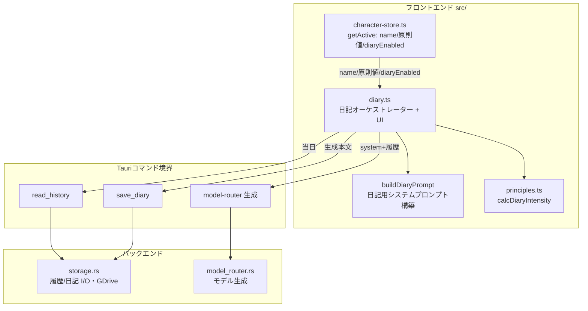
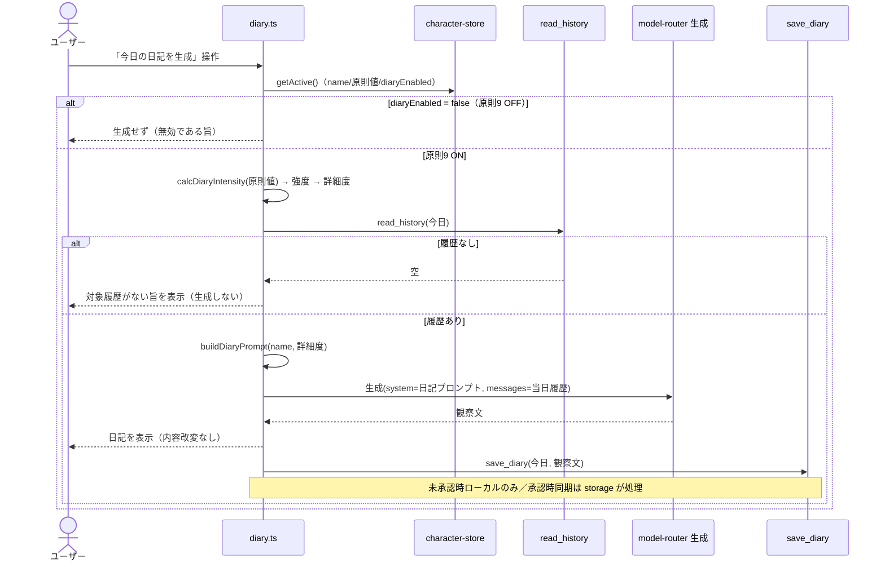
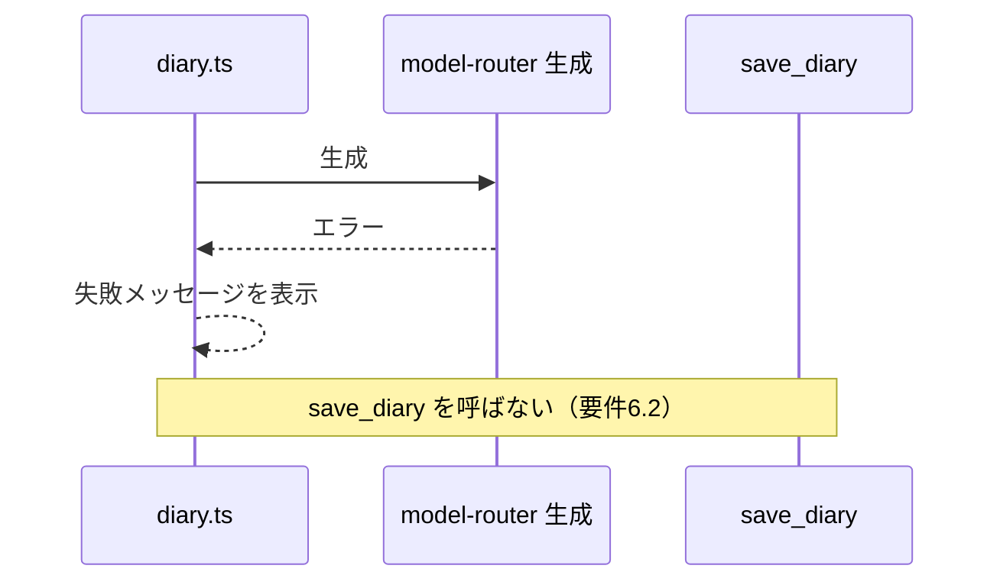

# 設計書

## 概要

diary-engine は原則 9「観察を記述する、評価しない」の実装である。原則 9 が ON のとき、ユーザー操作を契機に当日の対話履歴を収集し、アクティブな `CharacterSchema` のキャラクター名を冠した AI 一人称の観察日記を生成して画面に表示し、storage-manager 経由で保存する。日記の ON/OFF と詳細度は原則値から `calcDiaryIntensity` で自動導出する。

**ユーザー：** 選んだキャラクターと日々対話し、関係性の観察記録を残したいデスクトップユーザー。

**影響：** スタブ `src/diary.ts` を実装し、既存シーム（principles.ts の強度導出、storage-manager の `read_history`/`save_diary`、model-router のモデル生成）を統合する。マイルストーン M4「観察日記生成」を実現する。新規 Rust バックエンドは設けない。

### ゴール

- 原則 9 ON 時に当日履歴から AI 一人称の観察日記を生成・表示・保存する
- 強度（`calcDiaryIntensity`）に応じた詳細度で生成し、観察のみ・固定書き出し・AI 明示の制約を課す
- ユーザー操作起点のみで生成し、自動生成・自動有効化を行わない

### 非ゴール

- 対話履歴・日記ファイルの実 I/O（storage-manager）
- Google ドライブ承認管理・OAuth（storage-manager）
- キャラクター定義・原則値・原則 9 ON/OFF の編集 UI（character-layer・原則エンジン）
- モデル API 呼び出し基盤（model-router）

## 境界コミットメント

### 本Specが担う

- 原則 9 ON/OFF（`CharacterSchema.diaryEnabled`）に応じた生成の実行／抑止
- `calcDiaryIntensity` の値からの詳細度（キーワード〜詳細観察）の決定
- 当日履歴の収集依頼（`read_history`）と、履歴なし時の提示
- **日記用システムプロンプトの構築**（観察制約＋固定書き出し「今日、{name}として対話を記録する。」＋強度→詳細度＋AI 明示）
- 生成本文の画面表示と、保存依頼（`save_diary`）の発行
- 生成エラーの提示と、失敗時に保存を依頼しない制御

### 境界外

- 対話履歴・日記の物理 I/O、Google ドライブ同期・承認状態（storage-manager）
- `CharacterSchema`・原則値・`diaryEnabled` の生成／編集（character-layer・原則エンジン）
- モデル API への接続・認証・リトライ（model-router）

### 許可される依存

- character-layer：`character-store.getActive()`（`name`・`principleDefaults`・`diaryEnabled`）
- storage-manager：`read_history(date)`・`save_diary(date, content)`（未承認時ローカルのみは storage が担保）
- **model-router：観察日記本文の生成（呼び出し元が system プロンプトを供給できる汎用生成エントリ）** — research.md の設計判断参照
- principles.ts：`calcDiaryIntensity`

### 再検証トリガー

- `calcDiaryIntensity` の式・値域変更 → 詳細度マッピングの再確認
- `save_diary`／`read_history` の契約変更 → storage-manager との整合を再確認
- 固定書き出し文言・AI 明示文言の変更 → 原則 8/9 の核心、要件4 の再確認
- **model-router の汎用生成エントリの契約** → diary-engine の生成呼び出しを更新（cross-spec）

## アーキテクチャ

### 既存アーキテクチャ分析

- フロント↔Rust は Tauri コマンド境界のみ（structure.md）。diary-engine は既存コマンド（`read_history`・`save_diary`・model-router 生成）を呼ぶフロントオーケストレーターとして実装する。
- 自動選択・自動変更の禁止（structure.md）を踏襲し、生成はユーザー操作起点のみ。
- structure.md 依存グラフ（DE→CL・SM）に **DE→MR** が加わる（本文生成のため）。research.md に判断と Open Question を記録。

### アーキテクチャパターンと境界マップ

diary-engine は **フロントエンド・オーケストレーター**（`src/diary.ts`）として、既存シームを束ねる。



- **選択パターン**: フロントエンド・オーケストレーション（フレームワークなし TypeScript）。diary.ts が生成フローの権威。
- **依存方向**: principles/character-store（既存）→ diary.ts。diary.ts → Tauri コマンド（read_history / model 生成 / save_diary）。
- **既存パターン保持**: Tauri コマンド境界、`calcDiaryIntensity` 再利用、character-store 購読、storage の未承認時ローカル保存。

### テクノロジースタック

| レイヤー       | 採用技術            | 役割                                                         | 備考                    |
| -------------- | ------------------- | ------------------------------------------------------------ | ----------------------- |
| フロントエンド | TypeScript 7 + Vite | 日記生成オーケストレーション・UI・プロンプト構築             | vanilla。新規 Rust なし |
| 既存コマンド   | Tauri v2 invoke     | `read_history`/`save_diary`（storage）、生成（model-router） | 再利用のみ              |
| ロジック再利用 | principles.ts       | `calcDiaryIntensity`                                         | 強度導出                |

## ファイル構成計画

```
src/
├── diary.ts          # 日記オーケストレーター + UI（スタブから実装）。生成フロー・表示・保存依頼
├── diary-prompt.ts   # buildDiaryPrompt（観察制約・固定書き出し・強度→詳細度・AI明示）＋詳細度判定。純関数でテスト容易
└── principles.ts     # calcDiaryIntensity（再利用・変更なし）

index.html            # 日記パネル（生成ボタン・表示領域）のマウント点追加（変更）
```

### 変更対象ファイル

- `src/diary.ts` — スタブから本実装（オーケストレーター＋UI）
- `index.html` — `#diary-panel`（生成ボタン・本文表示）追加

## システムフロー

### フロー 1：日記生成（ON・履歴あり）



### フロー 2：生成エラー



## 要件トレーサビリティ

| 要件               | 概要                                     | コンポーネント                           | インターフェース                 | フロー  |
| ------------------ | ---------------------------------------- | ---------------------------------------- | -------------------------------- | ------- |
| 1.1, 1.2, 1.3      | 原則9 ON/OFF 制御・自動有効化禁止        | diary.ts                                 | getActive().diaryEnabled         | フロー1 |
| 2.1, 2.2, 2.3      | 強度導出・詳細度・自動調整なし           | diary.ts, principles.ts, diary-prompt.ts | calcDiaryIntensity → detailLevel | フロー1 |
| 3.1, 3.2, 3.3      | 当日履歴収集・履歴なし提示・当日限定     | diary.ts                                 | read_history(today)              | フロー1 |
| 4.1, 4.2, 4.3, 4.4 | 観察のみ・固定書き出し・結論なし・AI明示 | diary-prompt.ts                          | buildDiaryPrompt                 | フロー1 |
| 5.1, 5.2, 5.3, 5.4 | 表示・保存・未承認ローカル・内容不改変   | diary.ts, save_diary                     | save_diary(today, content)       | フロー1 |
| 6.1, 6.2           | エラー表示・失敗時非保存                 | diary.ts                                 | —                                | フロー2 |

## コンポーネントとインターフェース

### コンポーネント概要

| コンポーネント  | レイヤー                     | 責務                                       | 要件      | 主要依存                                                                 |
| --------------- | ---------------------------- | ------------------------------------------ | --------- | ------------------------------------------------------------------------ |
| diary.ts        | フロント・オーケストレーター | 生成フロー・UI・表示・保存依頼・エラー処理 | 1,2,3,5,6 | character-store, principles, read_history, model-router 生成, save_diary |
| diary-prompt.ts | フロント・ロジック           | 日記用システムプロンプト構築・詳細度判定   | 2,4       | calcDiaryIntensity（値の解釈）                                           |

### フロント・ロジック：diary-prompt.ts（要件 2, 4）

```typescript
// 詳細度。calcDiaryIntensity の値（加重和）を四捨五入し 1..5 にクランプしてバケット化する。
export type DetailLevel = "keywords" | "short" | "paragraph" | "detailed";

/** calcDiaryIntensity の値 → 詳細度（要件2.2）。1〜2=keywords, 3=short, 4=paragraph, 5=detailed。 */
export function detailLevelFromIntensity(intensity: number): DetailLevel;

/**
 * 日記用システムプロンプトを構築する（要件4.1〜4.4）。
 * - 観察のみ（評価・断定・感情の模倣を禁止）／結論を書かない
 * - 固定書き出し「今日、{name}として対話を記録する。」（要件4.2）
 * - 詳細度に応じた分量指示（keywords=3〜5語 … detailed=10文以上、要件2.2）
 * - AI（Mitatete）が生成した観察記録であることの明示（要件4.4・原則8）
 */
export function buildDiaryPrompt(name: string, detail: DetailLevel): string;
```

- **不変条件**: 返り値は固定書き出し文・AI 明示文・観察制約を必ず含む。`name` は character-store 由来。

### フロント・オーケストレーター：diary.ts（要件 1, 3, 5, 6 — Summary）

- `generateTodaysDiary()`：
  1. `character-store.getActive()` を取得。`diaryEnabled` が false なら生成せず通知（要件1.2/1.3）。
  2. `calcDiaryIntensity(active.principleDefaults)` → `detailLevelFromIntensity` で詳細度決定（要件2）。
  3. `read_history(today)`。空なら「対象履歴なし」を表示し生成しない（要件3.2）。当日分のみ（要件3.3）。
  4. `buildDiaryPrompt(active.name, detail)` を system に、当日履歴を messages にして **model-router 生成**を呼ぶ（要件4）。
  5. 応答（観察文）を画面に表示（要件5.1・内容改変なし 5.4）し、`save_diary(today, content)` を依頼（要件5.2）。未承認時ローカルのみは storage が担保（要件5.3）。
  6. 生成失敗時は失敗メッセージを表示し、`save_diary` を呼ばない（要件6）。
- ユーザー操作（生成ボタン）からのみ起動。タイマー・自動実行を持たない（要件1.3/2.3）。

**Implementation Note（統合／検証／リスク）**

- 統合：index.html に `#diary-panel`（生成ボタン・本文表示・通知行）を追加。diary.ts が起動時にボタンを配線。
- 生成エントリ：model-router の「汎用生成（system+messages→text）」を使用。未提供なら model-router 側に追加が必要（research.md・cross-spec 再検証トリガー）。
- 検証：`buildDiaryPrompt`/`detailLevelFromIntensity` は純関数でユニットテスト。オーケストレーターは生成・履歴・保存をモックして OFF/空/エラー経路を検証。
- リスク：観察制約は出力の完全保証不可（プロンプト制約）。固定書き出し・AI 明示・詳細度は構造的に検証する。

## データモデル

- **DiaryEntry**：`{ date: string /* YYYY-MM-DD */, content: string }`。保存は storage の `save_diary(date, content)`。
- **DetailLevel**：`"keywords" | "short" | "paragraph" | "detailed"`（diary-prompt.ts）。
- 当日履歴は `read_history` の戻り（対話メッセージ列の JSON）。diary.ts が messages へ整形する。

## エラーハンドリング

- 原則9 OFF・履歴なしは「正常な非生成」。ユーザーに理由を提示（要件1.2, 3.2）。
- 生成失敗・保存失敗はメッセージ表示。**生成失敗時は保存を呼ばない**（要件6.2）。
- 監視：エラーは `console.error`（フェーズ1）。

## テスト戦略

### ユニットテスト（vitest）

1. `detailLevelFromIntensity`：1〜2→keywords / 3→short / 4→paragraph / 5→detailed、境界（四捨五入・クランプ）を検証（要件2.2）。
2. `buildDiaryPrompt`：固定書き出し「今日、{name}として対話を記録する。」を含む／AI 明示文を含む／観察制約（評価・断定の禁止）を含む／詳細度ごとに分量指示が変わる（要件4.1〜4.4, 2.2）。
3. `generateTodaysDiary`（モック）：
   - `diaryEnabled=false` で生成・read_history・save_diary を呼ばない（要件1.2）。
   - 履歴なしで生成・save_diary を呼ばず通知（要件3.2）。
   - 正常時に生成→表示→`save_diary(today, 内容)` を内容改変なしで呼ぶ（要件5.1, 5.2, 5.4）。
   - 生成失敗時に `save_diary` を呼ばない（要件6.2）。

### 統合・E2E（手動・M4）

1. 原則9 ON・当日対話あり → 生成ボタン → 観察日記が表示・保存される（実機 `pnpm dev`）。
2. 未承認状態で保存がローカルに留まる（storage の挙動確認、要件5.3）。

## セキュリティ・整合考慮事項

- AI 明示（原則8）を全出力に含める（要件4.4）。
- 自動生成・自動有効化を行わない（要件1.3, 2.3・特許回避/ユーザー自律性、tech.md「設計上の制約」）。
- 当日履歴のみを対象とし過去日を含めない（要件3.3）。

## 決定事項 / Risks

- **DE→MR 依存（決定済み・2026-06-27）**: 本文生成を model-router に**委譲する**（ユーザー承認）。steering 依存グラフ（DE→CL・SM）に **DE→MR** を追加。model-router に「呼び出し元が system を供給できる汎用生成エントリ `generate(system, messages) -> text`」を設け、`send_message`（キャラ用 system 構築）はその薄いラッパとする（model-router の再検証トリガー）。
- **実装順（決定済み）**: **model-router 完成後に diary-engine 実装に着手**する。diary-engine の Tasks 生成は先行可。生成呼び出しは model-router の汎用 `generate` を前提とする。
- **トリガー**: MVP はユーザー操作（生成ボタン）。アプリ終了時自動生成等は将来検討。
- **残リスク**: 観察制約（評価・断定を含まない）は出力の完全保証不可。固定書き出し・AI 明示・詳細度は構造的に検証する。
