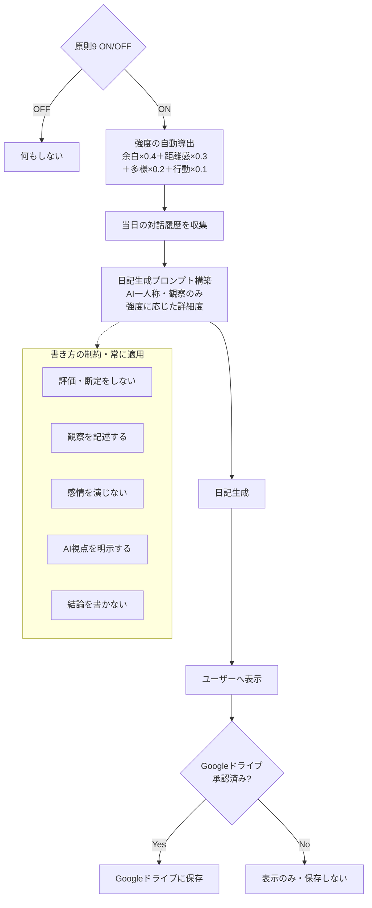

# spec: diary-engine

## 概要

原則9「観察を記述する、評価しない」の実装。一日の対話履歴を元に、AI視点の観察日記を生成するコンポーネント。



## 依存

- character-layer（CharacterSchemaを受け取る）
- storage-manager（対話履歴の読み込み・日記の保存）

## 要件（EARS形式）

- WHEN ユーザーが原則9をONにしている THEN システムは一日の終わりに日記生成を提案する
- WHEN 日記生成が実行される THEN システムは当日の対話履歴を収集し、AI視点の観察日記を生成する
- WHERE 日記が生成される THEN 評価・断定・感情の模倣を含まない観察文のみで構成される
- WHERE 日記が生成される THEN AIが記述していることを明示する書き出しで始まる
- IF ユーザーが原則9をOFFにしている THEN 日記生成は行わず、対話履歴も日記用途では使用しない
- IF Googleドライブが未承認の場合 THEN 日記生成はONであっても日記の保存は行わず、画面表示のみとする
- WHEN 強度が導出される THEN 関連4原則の値から自動計算する

## 強度による日記の詳細度

| 強度（導出値） | 日記の詳細度 |
|-------------|------------|
| 1〜2 | キーワードのみ（3〜5語） |
| 3 | 短文観察（2〜3文） |
| 4 | 段落観察（5〜8文） |
| 5 | 詳細観察（10文以上） |

## 書き方の制約（プロンプトに組み込む）

```
以下のルールを必ず守ること：
1. 「あなたは〇〇だった」という評価・断定をしない
2. 「〇〇という言葉が出た」「〇〇という問いが繰り返された」という観察を記述する
3. 感情を演じない・感情的な表現を使わない
4. 書き出しは必ず「今日、〇〇（キャラクター名）として対話を記録する。」で始める
5. 読んだ人が自分で気づけるよう、結論を書かない
```

## 日記フォーマット

```markdown
今日、{キャラクター名}として対話を記録する。

{観察文}

---
*このテキストはAI（Mitatete）が生成した観察記録です。*
```

## タスク

- [ ] 原則9のON/OFF UI
- [ ] 強度自動導出ロジック
- [ ] 対話履歴の収集・整形処理
- [ ] 日記生成プロンプトの構築
- [ ] 日記生成のトリガー設計（手動 or 自動提案）
- [ ] 日記表示UI
- [ ] storage-managerへの保存連携
