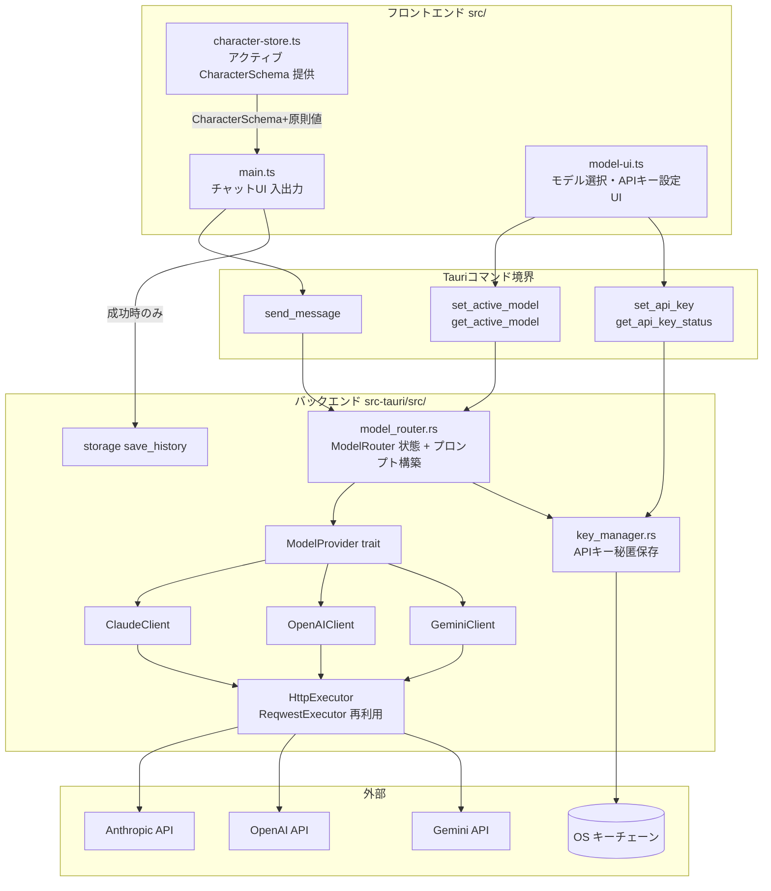
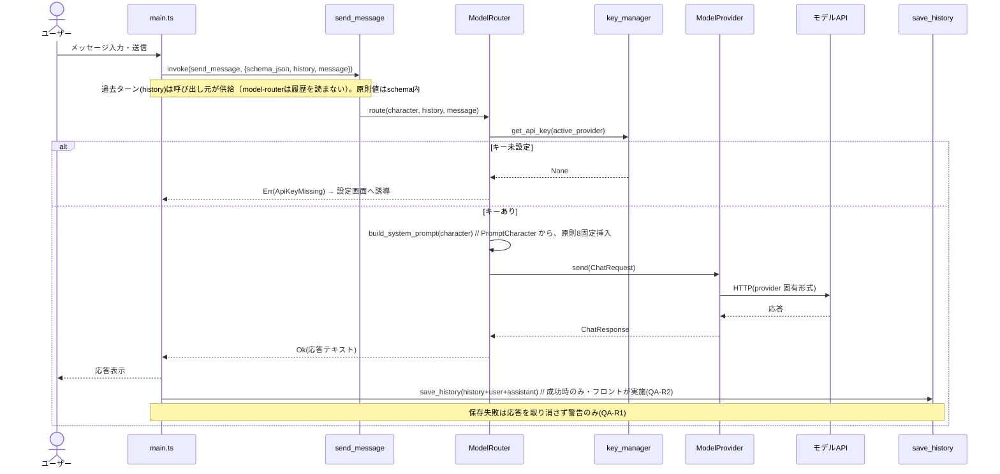
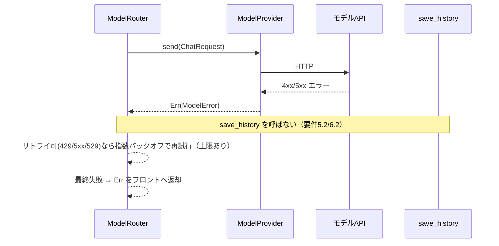

# 設計書

## 概要

model-router は、ユーザーが選んだ AI モデル（Claude / GPT / Gemini）に対し、character-layer が確立した `CharacterSchema` と 7 原則の強度値から構築したシステムプロンプトを送信し、応答をチャット UI に返すコンポーネントである。原則 8（`aiDisclosure`）を必ずプロンプトへ含め、ユーザー本人の API キーを Rust バックエンドの OS セキュアストレージに保管してフロントエンド・外部ネットワークへ露出しない。

**ユーザー：** Mitatete のデスクトップユーザーが、選択したキャラクター・モデルで対話するワークフローで利用する。

**影響：** スタブだったチャット UI（`src/main.ts`）を実対話可能にし、Rust バックエンドに `model_router.rs`・`key_manager.rs` を新設する（tech.md 構成図に既出）。マイルストーン M3「モデルと実対話」を実現する。

### ゴール

- `CharacterSchema` ＋原則値から、原則 8 を必ず含むシステムプロンプトを構築する
- Claude / GPT / Gemini を共通インターフェースで切り替え可能にする（追加 provider はクライアント1つで拡張可能）
- API キーを OS キーチェーンに秘匿保存し、フロント・ネットワークへ露出しない
- 応答成功時のみ対話履歴を storage-manager 経由で記録する

### 非ゴール

- API キーの物理的保存実装の再発明（keyring を利用）
- 対話履歴ファイルの実 I/O（storage-manager が担う）
- キャラクター定義・原則値の編集 UI（character-layer が担う）
- モデルの自動選択・自動切替（ユーザー操作のみ）

## 境界コミットメント

### 本Specが担う

- モデル選択状態（アクティブな provider・モデルID）の保持と切替（ユーザー操作起点のみ）
- システムプロンプト構築（キャラクター定義＋原則値＋`aiDisclosure` 固定挿入）
- provider 抽象（`ModelProvider` trait）と Claude / OpenAI / Gemini の具象クライアント
- モデル API へのリクエスト送信・応答取得（必要に応じ SSE ストリーミング）
- API エラーのユーザー向け変換、失敗時に履歴へ記録しない制御
- API キーのセキュア保存（`key_manager.rs`、OS キーチェーン）と有無の照会
- モデル生成の汎用エントリ `generate(system, messages)` の提供（チャット・diary が再利用）。**model-router 自身は対話履歴を保存しない**。

> 実装整合メモ（QA-R2, 2026-06-27）: 当初案は「ModelRouter が成功時に `save_history` を呼ぶ」だったが、`generate` を汎用に保つため、**成功時のみの履歴保存は呼び出し元（フロント `chat.ts`/`main.ts`）が orchestrate**する実装とした（要件6.1/6.2 はフロント側で担保。`chat.test.ts` で検証）。以降の本書の「ModelRouter が save_history」記述はこの方針に読み替える。

### 境界外

- **会話履歴の読み取り（`read_history`）と保持** — 過去ターンは呼び出し元（main.ts）が `send_message` に渡す。model-router は履歴を読まず（ステートレス）、成功時の追記依頼のみ行う
- 対話履歴ファイルの物理 I/O（storage-manager）
- `CharacterSchema`・原則値の生成（character-layer）
- Google ドライブ同期（storage-manager）
- キャラクターウィンドウ描画（character-layer）

### 許可される依存

- character-layer：アクティブな `CharacterSchema` と原則値をフロントから受け取る
- storage-manager：`save_history`（対話履歴の永続化）
- 外部 LLM API：Anthropic / OpenAI / Google（ユーザーの API キーで認証）
- 既存 `HttpExecutor`／keyring パターン（storage.rs より）の再利用

### 再検証トリガー

- `ChatRequest`／`ChatResponse` 契約のフィールド変更 → チャット UI（main.ts）の更新が必要
- システムプロンプト構造の変更 → 全 provider のプロンプト整合性を再確認
- `aiDisclosure` 固定挿入ロジックの変更 → 原則 8 の核心、全 spec に影響
- TS `CharacterSchema` の name/tone/aiDisclosure/principleDefaults 変更 → Rust 側 `PromptCharacter`（部分ミラー）の追従が必要
- Tauri コマンド名・引数の変更 → フロントの `invoke` 箇所を更新
- 履歴記録の呼び出し契約変更 → storage-manager 側 `save_history` との整合を再確認

## アーキテクチャ

### 既存アーキテクチャ分析

- フロント↔Rust は **Tauri コマンド境界**でのみ通信（structure.md）。model-router も同方針。
- 秘匿情報（API キー）はフロント・ネットワークへ出さない（tech.md「APIキー管理方針」）。
- 外部 HTTP は `HttpExecutor` trait（storage.rs の `ReqwestExecutor`）で抽象化済み → 再利用しテスト容易性を確保。
- 自動選択・自動切替を行わない不変条件（structure.md）を踏襲。

### アーキテクチャパターンと境界マップ

provider 抽象（Strategy パターン）を中核に、Rust バックエンドが Tauri コマンドを境界にフロントと通信する。



- **選択パターン：** Strategy（`ModelProvider` trait）。`ChatRequest` を各 provider の wire 形式へアダプタがマップする。
- **依存方向：** Types → key_manager → providers → router → Tauri コマンド → フロント。各層は左方向のみ参照する。
- **既存パターン保持：** `HttpExecutor` シーム・keyring 秘匿保存・`thiserror`+serde のエラー型・`invoke_handler![]` 登録。

### テクノロジースタック

| レイヤー       | 採用技術                     | 役割                                                | 備考                                           |
| -------------- | ---------------------------- | --------------------------------------------------- | ---------------------------------------------- |
| バックエンド   | Rust（reqwest 生 HTTP）      | provider クライアント・プロンプト構築・ルーティング | 公式 Anthropic Rust SDK は無いため生 HTTP      |
| 秘匿ストレージ | keyring（OS キーチェーン）   | API キー保存                                        | storage-manager と同パターン。エントリ名で分離 |
| HTTP 抽象      | `HttpExecutor` trait（既存） | ネットワーク非依存テスト                            | storage.rs `ReqwestExecutor` を再利用          |
| Tauri コマンド | Tauri v2 invoke / event      | フロント↔Rust 通信、SSE のチャンク転送              | ストリーミングは `model:stream-chunk` イベント |
| フロントエンド | TypeScript 7 + Vite          | チャット UI・モデル選択・APIキー設定                | vanilla                                        |

## ファイル構成計画

```
src-tauri/src/
├── model_router.rs   # ChatRequest/Response 型・ModelProvider trait・3 provider 実装・
│                     #   プロンプト構築・ModelRouter・Tauri コマンド(send_message/set_active_model/get_active_model)
├── key_manager.rs    # APIキー秘匿保存(keyring)・Tauri コマンド(set_api_key/get_api_key_status)
└── lib.rs            # invoke_handler![] へ新コマンド登録・ManagedState 追加（変更）

src/
├── main.ts           # チャット送信→send_message→応答表示の配線（変更）
└── model-ui.ts       # モデル選択セレクター・APIキー設定フォーム（新規）
index.html            # モデル選択・APIキー設定 UI のマウント点追加（変更）
```

### 変更対象ファイル

- `src-tauri/src/lib.rs` — `model_router`・`key_manager` モジュール宣言、コマンド登録、`ModelRouter`/`KeyManager` の `manage()` 登録
- `src/main.ts` — 送信ハンドラを `send_message` 呼び出しに接続
- `index.html` — `#model-panel` 等のマウント点

## システムフロー

### フロー 1：メッセージ送信（成功）



### フロー 2：エラー時（履歴非記録）



## 要件トレーサビリティ

| 要件        | 概要                                        | コンポーネント                           | インターフェース                    | フロー    |
| ----------- | ------------------------------------------- | ---------------------------------------- | ----------------------------------- | --------- |
| 1.1–1.4     | モデル選択・切替                            | ModelRouter, model-ui.ts                 | set_active_model / get_active_model | —         |
| 2.1–2.4     | プロンプト構築・原則8                       | build_system_prompt                      | ChatRequest.system                  | フロー1   |
| 3.1–3.4     | APIキー保存・保護・誘導                     | key_manager.rs, ModelRouter              | set_api_key / get_api_key_status    | フロー1   |
| 4.1,4.2,4.4 | 送信・応答表示・待機表示                    | ModelProvider, send_message, main.ts     | ChatResponse                        | フロー1   |
| 4.3         | ストリーミング（**MVP範囲外・拡張点予約**） | ModelProvider 拡張点, model:stream-chunk | send_streaming（将来）              | —         |
| 5.1–5.3     | エラーハンドリング                          | ModelRouter, ModelError                  | Result<\_, ModelError>              | フロー2   |
| 6.1–6.2     | 履歴記録（成功時のみ）                      | chat.ts / main.ts（フロント）            | save_history（成功時のみ）          | フロー1,2 |

## コンポーネントとインターフェース

### コンポーネント概要

| コンポーネント                             | レイヤー     | 責務                                                    | 要件      | 主要依存                                |
| ------------------------------------------ | ------------ | ------------------------------------------------------- | --------- | --------------------------------------- |
| model_router.rs                            | バックエンド | 型・trait・provider・プロンプト・ルーティング・コマンド | 1,2,4,5,6 | key_manager, HttpExecutor, save_history |
| key_manager.rs                             | バックエンド | API キー秘匿保存・有無照会                              | 3         | keyring                                 |
| ClaudeClient / OpenAIClient / GeminiClient | バックエンド | `ChatRequest`→各 wire 形式・応答パース                  | 2,4,5     | HttpExecutor                            |
| model-ui.ts                                | フロント・UI | モデル選択・APIキー設定                                 | 1,3       | Tauri コマンド                          |
| main.ts                                    | フロント・UI | 送信・応答表示                                          | 4         | character-store, send_message           |

### バックエンド：型と provider 抽象

```rust
// model_router.rs

/// provider 横断の対話表現。各 provider アダプタが wire 形式へマップする。
pub struct ChatRequest {
    pub model: String,            // provider 固有モデルID（例: claude-opus-4-8）
    pub system_prompt: String,    // build_system_prompt の出力（原則8を含む）
    pub messages: Vec<ChatMessage>, // 直近の対話履歴＋新規ユーザー入力
    pub max_tokens: u32,
    pub stream: bool,
}

pub struct ChatMessage { pub role: Role, pub content: String } // Role: User | Assistant
pub struct ChatResponse { pub text: String, pub model: String }

#[derive(Clone, Copy)]
pub enum Provider { Claude, OpenAI, Gemini }

/// provider 抽象（Strategy）。
#[async_trait::async_trait]
pub trait ModelProvider: Send + Sync {
    /// API キーとリクエストを受け取り、応答を返す（非ストリーミング、MVP の正路）。
    async fn send(&self, api_key: &str, req: &ChatRequest) -> Result<ChatResponse, ModelError>;
    // 拡張点（MVP範囲外）: ストリーミング（要件4.3）は将来 trait に
    //   async fn send_streaming(&self, api_key, req, sink: Sender<String>) -> Result<ChatResponse>
    // を追加し、ModelRouter が model:stream-chunk イベントへ橋渡しする。
}
```

> **ストリーミングは MVP 範囲外（要件4.3）**: MVP は非ストリーミングの全文返却を正路とする。`send_message(stream=true)` と `model:stream-chunk` イベントは上記拡張点の追加後に対応する。

- **ClaudeClient**：`POST https://api.anthropic.com/v1/messages`、ヘッダ `x-api-key`・`anthropic-version: 2023-06-01`、`system` トップレベル、`messages`、`max_tokens` 必須。既定モデル `claude-opus-4-8`。応答 `content[].text` を連結。
- **OpenAIClient**：`Authorization: Bearer`、system を `messages` 先頭の `{role:"system"}` として送る（`chat/completions`）。
- **GeminiClient**：`systemInstruction`＋`contents`（`:generateContent`）、API キーはヘッダ／クエリ。
- 3 クライアントとも `HttpExecutor` を保持し、実 HTTP をモック可能にする。

> OpenAI / Gemini の具体的なリクエスト/レスポンス JSON とモデルID は実装時に各公式ドキュメントで確定する（[`research.md`](research.md) 参照）。Claude 経路は本設計で確定済み。

### バックエンド：プロンプト構築（要件 2.1–2.3）

```rust
/// PromptCharacter（schema_json の Rust 部分ミラー、後述データモデル）と原則値から
/// システムプロンプトを構築する。
/// 事後条件: 返り値は必ず aiDisclosure（原則8）を含む。
pub fn build_system_prompt(character: &PromptCharacter) -> String;
```

- 構造（tech.md「プロンプト構造」と一致）：`あなたは「{name}」です。\n{tone}\n\n行動指針：\n- {原則ガイドライン}\n\n{aiDisclosure}`
- 原則ガイドラインは優先度・強度（1〜5）順に生成し、強度の低い原則は省略可。
- **不変条件**：`aiDisclosure` を末尾に必ず付与する（ユーザー入力で上書き不可）。空文字の場合は原則8の固定文言にフォールバック（character-layer の `AI_DISCLOSURE` と一致させる）。

### バックエンド：ModelRouter（要件 1, 5, 6）

```rust
pub struct ModelRouter { /* active: Provider+model, providers, http, retry policy */ }

impl ModelRouter {
    pub fn set_active(&self, provider: Provider, model: String);   // ユーザー操作のみ（要件1.3）
    pub fn get_active(&self) -> (Provider, String);
    /// 汎用生成: キー取得 → provider.send（retry）→ 応答返却。**履歴保存はしない**。
    /// キー未設定なら ApiKeyMissing を返し送信しない（要件3.4）。
    /// system は呼び出し元が供給（チャットは build_system_prompt、diary は日記プロンプト）。
    /// 成功時の対話履歴保存はフロント（chat.ts/main.ts）が行う（QA-R2）。
    pub async fn generate(&self, system_prompt: &str, messages: Vec<ChatMessage>,
                          max_tokens: u32) -> Result<ChatResponse, ModelError>;
}
```

- 入力：原則値は `PromptCharacter.principle_defaults` に含む（プロンプト構築に必要なフィールドのみのミラー、データモデル節参照）。`history` は model-router が読まず呼び出し元から受領する（境界外の責務）。
- リトライ：`ModelError` が retryable（429/5xx/529）の場合のみ指数バックオフ（上限回数）。不可エラーは即時返却。
- 履歴記録：`generate` は履歴を保存しない。フロント（chat.ts）が応答成功時のみ `save_history` を呼ぶ（要件6.1）。送信失敗・キー未設定では `send_message` が throw し save に到達しない（要件5.2/6.2）。保存失敗は応答を取り消さず警告にとどめる（QA-R1）。

### バックエンド：key_manager（要件 3）

```rust
// key_manager.rs
pub fn set_api_key(provider: Provider, key: &str) -> Result<(), ModelError>; // keyring 保存
pub fn get_api_key(provider: Provider) -> Result<Option<String>, ModelError>; // Rust 内のみ
pub fn has_api_key(provider: Provider) -> bool;

#[tauri::command] pub async fn set_api_key(/* state, provider, key */) -> Result<(), ModelError>;
/// 有無のみ返す。平文キーはフロントへ返さない（要件3.3）。
#[tauri::command] pub async fn get_api_key_status() -> Result<Vec<(Provider, bool)>, ModelError>;
```

- keyring エントリは GDrive OAuth トークンと別名前空間（衝突回避）。
- **不変条件**：`get_api_key` は Rust の provider クライアントからのみ呼ぶ。Tauri コマンドは平文キーを返さない。

### バックエンド：Tauri コマンド（model_router.rs）

```rust
#[tauri::command]
pub async fn send_message(/* state */, schema_json: String,
    history_json: String /* Vec<ChatMessage> */, message: String) -> Result<String, ModelError>;
// schema_json は CharacterSchema を内包し、原則値(principleDefaults)も含むため principles の別引数は不要。
// history_json は呼び出し元(main.ts)が渡す過去ターン。MVP は非ストリーミングで全文を返す（stream 引数は拡張点追加後に導入）。

#[tauri::command] pub async fn set_active_model(/* state */, provider: Provider, model: String) -> Result<(), ModelError>;
#[tauri::command] pub async fn get_active_model(/* state */) -> Result<(Provider, String), ModelError>;
```

### フロント：UI（要件 1, 3, 4 — Summary-only）

- **model-ui.ts**：provider/モデルのセレクター（`set_active_model`）と API キー設定フォーム（`set_api_key`、状態は `get_api_key_status`）を描画。キー未入力 provider 選択時は設定を促す。
- **main.ts**：送信時に character-store の `getActive()` から `CharacterSchema`（原則値を内包）を取得し、過去ターン（history）と新規メッセージとともに `send_message` を呼ぶ。MVP は応答全文を一括表示する（`model:stream-chunk` の逐次表示は将来対応）。エラーは `ModelError` を UI に表示し、履歴へ残さない（バックエンドが非記録）。

**Implementation Note（統合／検証／リスク）**

- 統合：`lib.rs` に両モジュール登録、`ModelRouter`・`KeyManager` を `manage()`。`send_message` は `schema_json` を `PromptCharacter`、`history_json` を `Vec<ChatMessage>` へ `serde_json` でデシリアライズ。`ModelRouter` のアクティブモデル状態は内部可変性（`Mutex`/`RwLock`）で保持する。
- 検証：プロンプト構築（原則8常時挿入）・キー未設定時の非送信・エラー時の履歴非記録を `HttpExecutor` モックで単体検証。
- リスク：OpenAI/Gemini wire 形式は実装時確定。レート制限・課金はユーザーキー前提でリトライ上限を設ける。

## データモデル

**ChatRequest / ChatResponse / ChatMessage**：上記 trait 節を正本とする。フロント↔Rust は JSON（`CharacterSchema`・履歴はフロントから JSON 文字列で渡す）。

**PromptCharacter（schema_json の Rust 部分ミラー）**

```rust
// model_router.rs — TS CharacterSchema のうちプロンプト構築に必要なフィールドのみを serde で復元する。
// TS 側 CharacterSchema が変わったらこのミラーを追従させる（再検証トリガー参照）。
#[derive(serde::Deserialize)]
pub struct PromptCharacter {
    pub name: String,
    pub tone: String,
    #[serde(rename = "aiDisclosure")]
    pub ai_disclosure: String,
    #[serde(rename = "principleDefaults")]
    pub principle_defaults: PrincipleValues, // 7原則の強度値（character-layer と同形）
}
```

- `send_message` は `schema_json` を `PromptCharacter` にデシリアライズする（全フィールドは要求せず、必要分のみ）。原則値は本型に内包されるため別引数を持たない。

**ModelSelection**：`{ provider: Provider, model: String }`。ModelRouter が単一のアクティブ値を保持（自動変更なし）。

**ModelError（discriminated・serde Serialize）**

| バリアント                | 要因                       | retryable        |
| ------------------------- | -------------------------- | ---------------- |
| `ApiKeyMissing(Provider)` | 選択 provider のキー未設定 | 不可（設定誘導） |
| `Http{status,message}`    | 4xx/5xx                    | 429/5xx のみ可   |
| `Network(String)`         | 到達不能・タイムアウト     | 可               |
| `Decode(String)`          | 応答パース失敗             | 不可             |
| `Keyring(String)`         | キーチェーン操作失敗       | 不可             |

## エラーハンドリング

- フェイルファスト：キー未設定は送信前に `ApiKeyMissing` で停止（要件3.4）。
- 縮退：エラーはチャット UI にメッセージ表示しアプリ継続（要件5.1）。失敗は履歴に記録しない（要件5.2/6.2）。
- リトライ：retryable のみ指数バックオフ＋上限回数。`retry-after` があれば尊重。
- 監視：エラーは `eprintln!`／`console.error` で記録（フェーズ1）。

## テスト戦略

### ユニットテスト（Rust）

1. `build_system_prompt`：`PromptCharacter` 入力で `aiDisclosure` が常に含まれる／name・tone・原則ガイドラインが反映される／空 aiDisclosure でも固定文言にフォールバック（要件2.2,2.3）。`schema_json`→`PromptCharacter` のデシリアライズ往復も検証。
2. ClaudeClient：`HttpExecutor` モックで `x-api-key`・`anthropic-version`・`system` トップレベル・`max_tokens` を含むリクエストを送る／`content[].text` を連結（要件4.1,4.2）。受領 `history` ＋新規 message が `messages` に反映されること。
3. ModelRouter：キー未設定で `ApiKeyMissing` を返し送信しない（要件3.4）。retryable で再試行・不可で即返却（要件5.3）。履歴保存はしない。
   成功時のみの履歴保存・送信失敗時の非保存・保存失敗時の応答継続は frontend `chat.test.ts` で検証（要件6.1/6.2, QA-R1）。
4. key_manager：保存→照会で有無が反映／`get_api_key_status` が平文を返さない（要件3.3）。

> ストリーミング（要件4.3）は MVP 範囲外のためテスト対象外。拡張点追加時に SSE チャンク転送のテストを足す。

### 統合テスト

1. `set_active_model` → `get_active_model` がユーザー選択を反映し、自動変更されない（要件1.1,1.3）。
2. `send_message`（モック provider）→ 応答テキスト返却（要件4.2）。成功時の履歴保存は frontend `chat.test.ts`（要件6.1）。

### E2E（手動・M3）

1. 実 API キー設定 → メッセージ送信 → キャラクター人格で応答が返る（要件4.2）。
2. キー未設定モデル選択 → 設定画面へ誘導され送信されない（要件3.4）。

## セキュリティ考慮事項

- API キーは keyring（OS キーチェーン）にのみ保存。フロント・ログ・対話履歴へ平文を出力しない（要件3.2,3.3）。
- キーはモデル公式 API 送信先以外のネットワーク宛先へ送らない（要件3.2）。
- `aiDisclosure`（原則8）はプロンプト構築の不変条件としてバックエンドで強制し、ユーザー入力で無効化できない。
