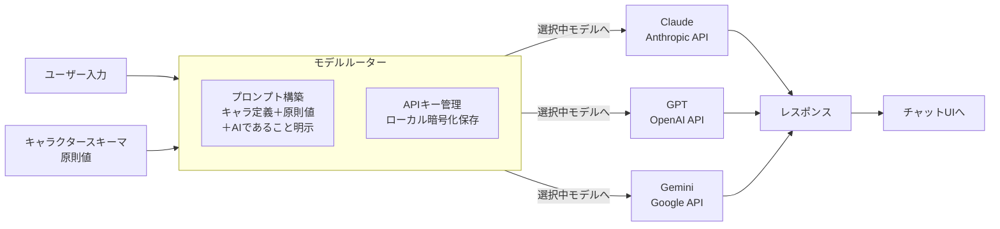

# spec: model-router

## 概要

Claude・GPT・Geminiを切り替えながら、キャラクタースキーマと原則値を組み込んだプロンプトを構築してAPIへ送信するコンポーネント。



## 依存

- character-layer（CharacterSchemaを受け取る）

## 要件（EARS形式）

- WHEN ユーザーがモデルを切り替える THEN システムは次のリクエストから選択されたモデルのAPIを使用する
- WHEN APIリクエストを送信する THEN システムはCharacterSchemaと原則値をシステムプロンプトに組み込む
- WHERE システムプロンプトが構築される THEN 原則8のaiDisclosureが必ず含まれる
- WHEN APIキーが未設定のモデルが選択される THEN システムはAPIキー設定画面へ誘導し、リクエストを送信しない
- IF APIレスポンスがエラーの場合 THEN システムはエラーメッセージをチャットUIに表示し、対話履歴には記録しない

## サポートモデル

| モデル | APIエンドポイント | 認証方式 |
|--------|----------------|---------|
| Claude（Anthropic） | `https://api.anthropic.com/v1/messages` | APIキー（x-api-key） |
| GPT（OpenAI） | `https://api.openai.com/v1/chat/completions` | APIキー（Bearer） |
| Gemini（Google） | `https://generativelanguage.googleapis.com/v1beta/models/` | APIキー |

## プロンプト構築ロジック

```javascript
function buildSystemPrompt(schema, principles) {
  return `
あなたは「${schema.name}」です。
${schema.tone}

行動指針：
- ${buildPrincipleGuidelines(principles)}

${schema.aiDisclosure}
`.trim();
}

function buildPrincipleGuidelines(principles) {
  // 優先度順・強度に応じたガイドラインテキストを生成
  return principles
    .sort((a, b) => a.rank - b.rank)
    .filter(p => p.intensity >= 2)
    .map(p => principleToGuideline(p))
    .join('\n- ');
}
```

## APIキー管理

- 設定画面からユーザーが入力
- TauriのセキュアストレージAPI（OS keychain）に保存
- Rustバックエンド経由でのみAPIキーにアクセス可能
- フロントエンド側への露出禁止

## タスク

- [ ] モデル選択UIの実装
- [ ] 各モデルのAPIクライアント実装（Claude / GPT / Gemini）
- [ ] プロンプト構築ロジック
- [ ] APIキー設定UI・保存処理
- [ ] エラーハンドリング・リトライ設計
- [ ] レスポンスのストリーミング対応
