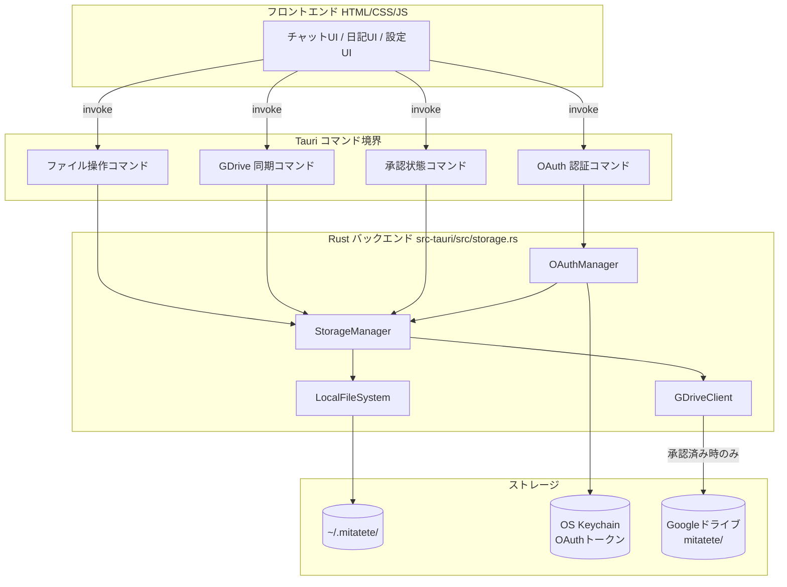
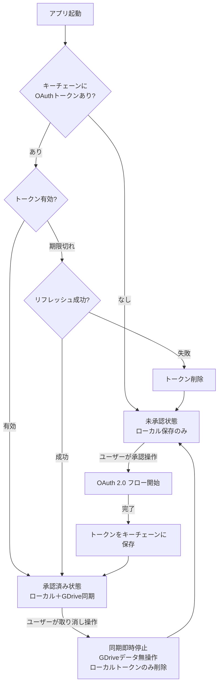
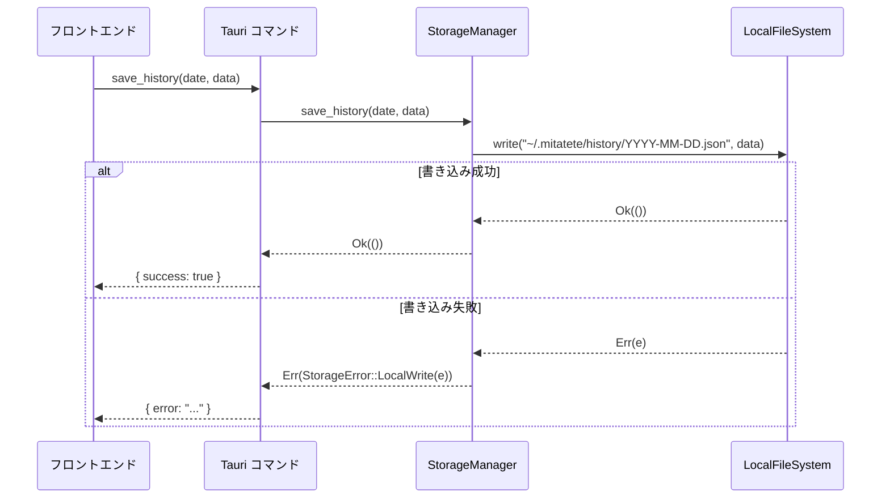
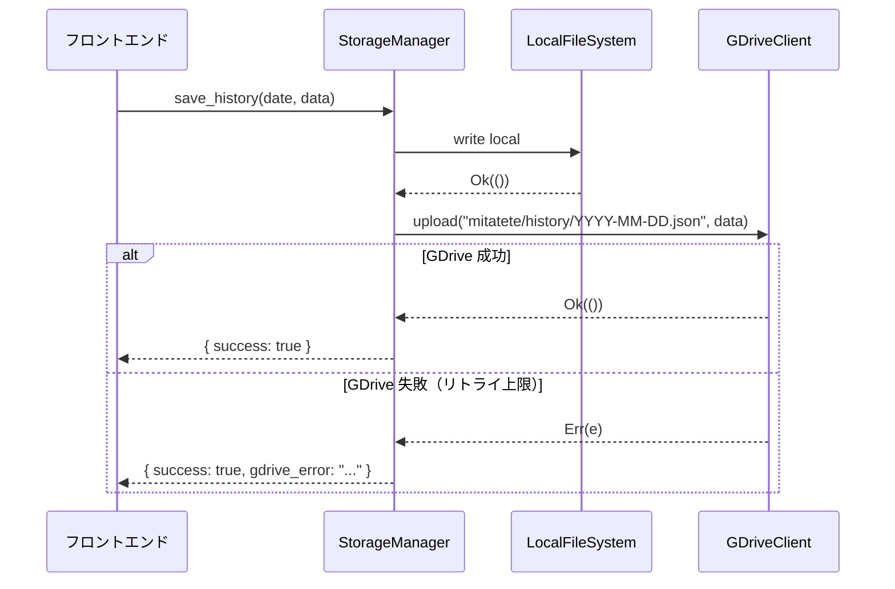

# 設計書

## 概要

**storage-manager** は Mitatete の全データ永続化を担う Rust バックエンドコンポーネントである。ローカルファイルシステム（`~/.mitatete/`）への常時保存と、OAuth 2.0 承認を経た Googleドライブへの条件付き同期という 2 本立ての保存戦略を実装する。

フロントエンド（HTML/CSS/JS）は直接ファイルにアクセスせず、Tauri コマンドを唯一の通信経路とする。これにより、センシティブデータのフロントエンド露出を防止し、Rust 側でトランザクション的な保存制御を実現する。

承認状態による動作の分岐はシステムが透明に管理し、ユーザー操作（承認・取り消し）のみがその状態を変更できる。承認取り消し時はクラウドデータに触れず OAuth トークンのみを削除するという不変条件を厳守する。

### 目標

- ローカル常時保存により、Googleドライブ未承認でも全機能を利用可能にする
- OAuth 2.0 フローにより Googleドライブ同期をオプトインで提供する
- 承認取り消し時のデータ不変性（クラウド既存データへの無操作）を保証する
- Tauri コマンドによるフロントエンドとの明確な境界を確立する

### 非目標

- API キーのセキュアストレージ管理（`key_manager.rs` の責務）
- チャット UI・キャラクター層・日記エンジンの実装
- AI モデル呼び出し
- リアルタイム双方向同期・競合解決（複数デバイスからの同時書き込み）

## 境界コミットメント

### このスペックが所有する責務

- `~/.mitatete/` 以下のディレクトリ構造の初期化と全ファイル I/O
- OAuth 2.0 認証フローの開始・完了・トークン保存・リフレッシュ・削除
- Googleドライブ承認状態の管理とフロントエンドへの通知
- Google Drive API クライアントを用いたファイルアップロード
- 保存失敗時のエラー返却とリトライ制御
- フロントエンド向けの全 Tauri コマンドの定義

### 境界外

- `key_manager.rs` が管理する API キーのキーチェーン保存・読み出し
- 日記生成・チャット処理・原則エンジンのビジネスロジック
- UI 層のエラー表示・ユーザー通知の描画
- Googleドライブ上のファイル削除や移動（承認後のクリーンアップ含む）

### 許可された依存

- Tauri v2 API（コマンド登録・ファイルシステムプラグイン・セキュアストレージ）
- Google Drive API v3（OAuth 2.0 + ファイル CRUD）
- Rust 標準ライブラリおよび `tokio`（非同期処理）

### 再検証トリガー

- Tauri コマンドのシグネチャ（引数・戻り値型）変更 → フロントエンド呼び出し側に影響
- OAuth トークン保存場所の変更 → `key_manager.rs` との境界に影響
- `~/.mitatete/` のディレクトリ構造変更 → `diary-engine`・`character-layer` のパス期待に影響

## アーキテクチャ

### アーキテクチャパターンと境界マップ

storage-manager は **Tauri コマンドゲートウェイパターン** を採用する。フロントエンドはすべての I/O を Tauri コマンドを通じて依頼し、Rust バックエンドが実際の操作を行う。



**承認状態フロー:**



### 技術スタック

| レイヤー           | 技術・バージョン           | 役割                                  |
| ------------------ | -------------------------- | ------------------------------------- |
| プラットフォーム   | Tauri v2                   | コマンド登録・アプリライフサイクル    |
| バックエンド       | Rust + tokio               | 非同期ファイル I/O・HTTP クライアント |
| フロントエンド通信 | Tauri コマンド             | フロントエンドとの唯一の境界          |
| ローカルストレージ | 標準ファイルシステム       | `~/.mitatete/` 以下                   |
| 認証               | OAuth 2.0（Google）        | GDrive アクセストークン取得           |
| クラウドストレージ | Google Drive API v3        | ファイルアップロード                  |
| セキュアストレージ | Tauri stronghold / keyring | OAuth トークン保存                    |

## ファイル構造計画

### ディレクトリ構成

```
src-tauri/
└── src/
    └── storage.rs           # StorageManager・LocalFileSystem・OAuthManager・GDriveClient
                             # （将来的に規模拡大時は storage/ モジュールに分割）

# ランタイムデータ（ユーザーホーム）
~/.mitatete/
├── settings.json            # キャラクター・原則設定
├── characters/              # カスタムキャラクター定義（*.json）
├── history/
│   └── YYYY-MM-DD.json      # 対話履歴（日別）
└── diary/
    └── YYYY-MM-DD.md        # AI観察日記（日別）

# GDrive（承認済み時のみ）
mitatete/
├── settings.json
├── history/YYYY-MM-DD.json
└── diary/YYYY-MM-DD.md
```

### 変更ファイル

- `src-tauri/src/main.rs` — storage コマンドをアプリハンドラーに登録
- `src-tauri/src/storage.rs` — 新規作成（本スペックの主実装）
- `src-tauri/Cargo.toml` — Google Drive API・OAuth クレートの依存追加

## システムフロー

### ローカル保存フロー



### Googleドライブ同期フロー（承認済み時）



ローカル保存は常に先行して行い、GDrive 失敗はローカル保存の成否に影響しない。GDrive エラーは独立したフィールドで返却しフロントエンドに通知する。

## 要件トレーサビリティ

| 要件    | 概要               | コンポーネント                | インターフェース                                                              |
| ------- | ------------------ | ----------------------------- | ----------------------------------------------------------------------------- |
| 1.1–1.7 | ローカル常時保存   | LocalFileSystem               | save*history / save_settings / save_character / save_diary / read*\* コマンド |
| 2.1–2.5 | OAuth 認証フロー   | OAuthManager                  | start_oauth / get_auth_status / revoke コマンド                               |
| 3.1–3.3 | GDrive 同期        | GDriveClient                  | StorageManager 内で LocalFileSystem と並行実行                                |
| 4.1–4.5 | 承認取り消し       | OAuthManager + StorageManager | revoke_auth コマンド                                                          |
| 5.1–5.4 | エラーハンドリング | StorageManager                | 全コマンドの Err 戻り値                                                       |
| 6.1–6.3 | Tauri コマンド境界 | 全コンポーネント              | Tauri コマンド定義                                                            |

## コンポーネントとインターフェース

### コンポーネント概要

| コンポーネント  | レイヤー         | 責務                                               | 要件カバレッジ | 主要依存                                                   |
| --------------- | ---------------- | -------------------------------------------------- | -------------- | ---------------------------------------------------------- |
| StorageManager  | ビジネスロジック | ローカル・GDrive の保存調整、承認状態判定          | 1, 3, 4, 5, 6  | LocalFileSystem (P0), OAuthManager (P0), GDriveClient (P1) |
| LocalFileSystem | インフラ         | `~/.mitatete/` 以下のファイル読み書き              | 1, 5           | tokio::fs (P0)                                             |
| OAuthManager    | 認証             | OAuth 2.0 フロー、トークン保存・リフレッシュ・削除 | 2, 4           | Tauri keyring (P0), Google OAuth API (P0)                  |
| GDriveClient    | 外部連携         | Google Drive API v3 を用いたファイルアップロード   | 3, 5           | OAuthManager (P0), reqwest (P0)                            |
| Tauri コマンド  | 境界ゲートウェイ | フロントエンドとの唯一の通信経路                   | 6              | StorageManager (P0)                                        |

### バックエンド / Rust レイヤー

#### StorageManager

| フィールド | 詳細                                                                                                 |
| ---------- | ---------------------------------------------------------------------------------------------------- |
| Intent     | ローカル保存とGDrive同期を調整するオーケストレーター。承認状態に応じてGDriveClientへの委譲を制御する |
| 要件       | 1, 3, 4, 5, 6                                                                                        |

**責務と制約**

- フロントエンドからの保存要求を受け取り、ローカルに先行保存する
- 承認済みの場合のみ GDriveClient に非同期でアップロードを委譲する
- ローカル保存失敗と GDrive 失敗を独立したエラーとして扱う

**依存**

- Inbound: Tauri コマンド → StorageManager への保存要求（Critical）
- Outbound: LocalFileSystem — ファイル読み書き（Critical）、OAuthManager — 承認状態取得（Critical）、GDriveClient — GDrive アップロード（Optional）

**コントラクト**: Tauri コマンド [x] / 状態 [x]

##### サービスインターフェース（Rust 擬似コード）

```rust
// Tauri コマンドとして公開
async fn save_history(date: String, data: Value) -> Result<(), StorageError>
async fn save_settings(data: Value) -> Result<(), StorageError>
async fn save_character(name: String, data: Value) -> Result<(), StorageError>
async fn save_diary(date: String, content: String) -> Result<(), StorageError>
async fn read_history(date: String) -> Result<Value, StorageError>
async fn read_settings() -> Result<Value, StorageError>
async fn get_auth_status() -> Result<AuthStatus, StorageError>
async fn start_oauth() -> Result<(), StorageError>
async fn revoke_auth() -> Result<(), StorageError>
```

#### LocalFileSystem

| フィールド | 詳細                                                                      |
| ---------- | ------------------------------------------------------------------------- |
| Intent     | `~/.mitatete/` 以下のディレクトリ初期化・ファイル読み書きを担うインフラ層 |
| 要件       | 1, 5                                                                      |

**責務と制約**

- アプリ起動時に `~/.mitatete/{history,diary,characters}/` を作成（存在する場合はスキップ）
- UTF-8 JSON / Markdown の読み書き
- ファイルパスはすべてこのコンポーネント内で構築し、外部からパス文字列を受け取らない（パストラバーサル防止）

#### OAuthManager

| フィールド | 詳細                                                                                  |
| ---------- | ------------------------------------------------------------------------------------- |
| Intent     | Google OAuth 2.0 フローの開始・完了・トークンのセキュア保存・リフレッシュ・削除を担う |
| 要件       | 2, 4                                                                                  |

**責務と制約**

- OAuth トークンは OS キーチェーン（Tauri stronghold / keyring）にのみ保存する
- API キーをファイルや GDrive に書き出さない（絶対不変条件）
- 承認取り消し時はキーチェーンからトークンを削除するのみで、GDrive 上のデータには触れない

#### GDriveClient

| フィールド | 詳細                                                                             |
| ---------- | -------------------------------------------------------------------------------- |
| Intent     | Google Drive API v3 を使い、`mitatete/` フォルダ以下にファイルをアップロードする |
| 要件       | 3, 5                                                                             |

**責務と制約**

- StorageManager から渡されたデータを GDrive に書き込む
- センシティブデータ（API キーを含む）を GDrive に書き込まない（絶対不変条件）
- 失敗時は StorageManager にエラーを返し、リトライ回数は StorageManager が管理する

## データモデル

### ローカルファイル

**対話履歴** `~/.mitatete/history/YYYY-MM-DD.json`:

```json
{
  "date": "YYYY-MM-DD",
  "messages": [
    { "role": "user" | "assistant", "content": "string", "timestamp": "ISO8601" }
  ]
}
```

**設定** `~/.mitatete/settings.json`:

```json
{
  "active_character": "string",
  "principles": { "key": "number (0-1)" }
}
```

**カスタムキャラクター** `~/.mitatete/characters/<name>.json`:
CharacterSchema 準拠（`character-layer` スペック参照）

**AI観察日記** `~/.mitatete/diary/YYYY-MM-DD.md`:
Markdown 形式のフリーテキスト

### 承認状態

```rust
enum AuthStatus {
  Unauthorized,   // OAuthトークンなし・期限切れリフレッシュ失敗
  Authorized,     // 有効なOAuthトークンあり
}
```

### エラー型

```rust
enum StorageError {
  LocalWrite(String),        // ローカルファイル書き込み失敗
  LocalRead(String),         // ローカルファイル読み込み失敗
  GDriveUpload(String),      // GDriveアップロード失敗
  OAuthFailed(String),       // OAuth フロー失敗
  TokenRefreshFailed,        // トークンリフレッシュ失敗
  Unauthorized,              // 未承認での GDrive 操作試行
}
```

## エラーハンドリング

### エラー戦略

ローカル保存と GDrive 保存は独立して扱い、一方の失敗が他方に影響しない。全 Tauri コマンドは `Result<T, StorageError>` を返し、フロントエンドが UI 通知を判断できるようにする。

### エラーカテゴリーと対応

| エラー種別               | 発生箇所        | 対応                                                                                        |
| ------------------------ | --------------- | ------------------------------------------------------------------------------------------- |
| ローカル書き込み失敗     | LocalFileSystem | エラーをフロントエンドに返却。ユーザー通知で対処を促す                                      |
| GDrive アップロード失敗  | GDriveClient    | リトライ（最大3回・指数バックオフ）。上限到達でフロントエンドに警告。ローカルには影響しない |
| OAuth フロー失敗         | OAuthManager    | エラーをフロントエンドに返却。未承認状態を維持する                                          |
| トークンリフレッシュ失敗 | OAuthManager    | トークン削除・未承認状態へ移行・フロントエンドに通知                                        |

## テスト戦略

### ユニットテスト

- `LocalFileSystem`: ディレクトリ初期化・ファイル読み書き・パス構築の正確性
- `OAuthManager`: トークン保存・削除・有効期限判定
- `StorageManager`: 未承認時は GDriveClient を呼ばないことの確認、エラー独立性
- `GDriveClient`: API 呼び出しのモック検証

### 統合テスト

- OAuth フロー完了 → GDrive 同期有効化 → 保存コマンド実行 → GDrive アップロード確認
- 承認取り消し → トークン削除のみ・GDrive データ無操作の確認
- GDrive 失敗時にローカル保存は成功することの確認
- トークン期限切れ → リフレッシュ → 成功・失敗それぞれのパス確認

### E2E テスト

- Tauri アプリ起動 → 未承認状態確認 → 保存コマンド → `~/.mitatete/` ファイル存在確認
- OAuth 承認フロー → 承認済み状態確認 → 取り消し → 未承認状態確認

## セキュリティ考慮事項

- **APIキー不在の絶対保証**: storage.rs はキーチェーンから API キーを読まない。`key_manager.rs` の責務であり、混入を防ぐためコードレビューで確認する
- **パストラバーサル防止**: ファイルパスは LocalFileSystem 内で構築。フロントエンドから任意パスを受け取るインターフェースを設けない
- **センシティブデータの GDrive 除外**: API キーを含む機密情報を GDriveClient に渡さないことをコントラクトで保証する
- **OAuth トークンのセキュア保存**: OS キーチェーン（Tauri stronghold / keyring）のみに保存し、ファイルシステム・GDrive には書き出さない
