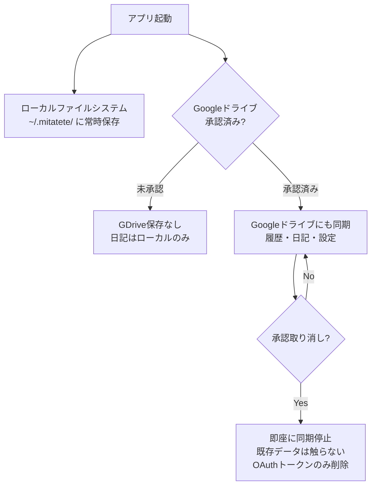

# spec: storage-manager

## 概要

ローカルファイルシステムおよびGoogleドライブ連携によるデータ永続化を管理するコンポーネント。ローカル保存は常時利用可能。Googleドライブはユーザーの承認状態に応じて有効化される。



## 要件（EARS形式）

- WHEN 拡張機能が起動する THEN システムはGoogleドライブの承認状態を確認する
- WHEN ユーザーがGoogleドライブを承認する THEN システムはOAuth 2.0フローを起動し、承認完了後にデータ同期を開始する
- WHEN Googleドライブが未承認の場合 THEN システムはchrome.storage.sessionのみ使用し、拡張終了でデータを消去する
- WHEN ユーザーが承認を取り消す THEN システムは即座に保存を停止し、Googleドライブ上の既存データは一切操作しない
- WHERE データをGoogleドライブに保存する THEN ユーザーのGoogleドライブ内のmitatete/フォルダに保存する
- IF 保存処理が失敗した場合 THEN システムはユーザーに通知し、セッションストレージへのフォールバックを試みる

## 承認状態による機能マッピング

| 機能 | 常時（ローカル） | Googleドライブ承認済み |
|------|----------------|----------------------|
| チャット | 利用可 | 利用可 |
| キャラクター設定の保持 | ローカル永続 | GDriveにも同期 |
| 原則設定の保持 | ローカル永続 | GDriveにも同期 |
| 対話履歴 | ローカル保存 | GDriveにも同期 |
| 日記（原則9） | ローカル保存 | GDriveにも同期 |
| 複数デバイス同期 | 不可 | 可 |

## ローカルファイル構造

```
~/.mitatete/
├── settings.json          # キャラクター・原則設定
├── characters/            # カスタムキャラクター定義
├── history/
│   └── YYYY-MM-DD.json   # 対話履歴（日別）
└── diary/
    └── YYYY-MM-DD.md     # AI観察日記（日別）
```

## データ保存ポリシー

- 個人情報・センシティブ情報はGoogleドライブに保存しない
- APIキーはTauriのセキュアストレージ（OS keychain）のみに保存し、ファイルシステムやGoogleドライブには書き出さない
- 承認取り消し後はローカルのOAuthトークンのみ削除し、クラウドデータには触れない
- すべてのファイルI/OはRustバックエンド経由で行い、フロントエンドから直接アクセスしない

## タスク

- [ ] Rustバックエンドのファイルシステムアクセス実装
- [ ] OAuth 2.0フローの実装（Tauri shell / Rustクレート）
- [ ] Googleドライブ承認状態の管理・UI表示
- [ ] ローカルファイル読み書き（Rust）
- [ ] Google Drive API クライアント実装（Rust）
- [ ] 承認取り消し処理
- [ ] 保存失敗時のエラーハンドリング
- [ ] フロントエンド↔Rustバックエンド間のTauriコマンド定義
