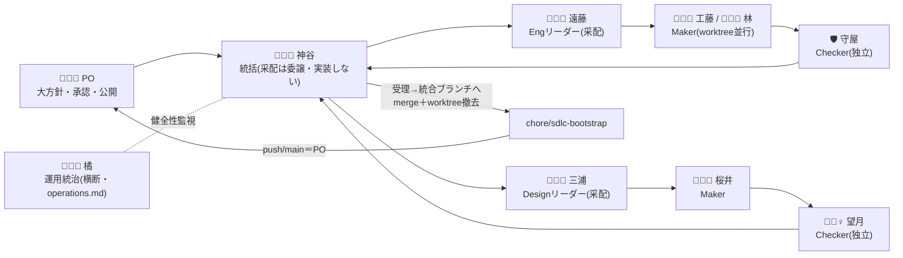

# orchestration.md — コンダクター・オーケストレーション運用

本運用の正式名称は **「コンダクター・オーケストレーション（Conductor Orchestration）」**。コンダクター（メイン Claude セッション）が配下のワーカー（subagent）へ実装を委譲し、独立レビューと新鮮な証拠で受理する並行開発体制。命名は一般用語で行う（比喩・ふざけた名称は実務ノウハウのノイズになるため使わない）。人間（ユーザー）は大方針と各フェーズ承認・公開判断を担い、後述の委譲規律そのものには参加しない（規律はコンダクターの受理プロセス自体で効く）。

## 役割

| 役割                 | 実体                                  | 権限                                                                     |
| -------------------- | ------------------------------------- | ------------------------------------------------------------------------ |
| ユーザー             | 人間                                  | 大方針・各フェーズ承認・push/公開判断                                    |
| コンダクター         | メインセッション                      | 計画分解・委譲・レビュー統括・統合・上申。**大きな実装は自分でやらない** |
| 調査エージェント     | `Explore` subagent                    | read-only（探索）                                                        |
| 設計エージェント     | `Plan` / `spec-design-agent`          | read-only（設計提案）                                                    |
| 実装エージェント     | `Agent`（`isolation:"worktree"`）     | 自 worktree で実装・コミット                                             |
| レビューエージェント | `kiro-review` を実行する独立 subagent | 受理判定（実装者とは別）                                                 |

- **観測**：人間は `scripts/dev-dashboard.sh`（tmux）で worktree / git / テスト / 進捗ログを並行確認する。

### 全体の流れ（采配 → 実装 → 受理 → 統合）



## 職能レーン：エンジニアリングとデザイン（プロジェクト横断で採用）

コンダクター・オーケストレーションは **2つの職能レーン（discipline lane）** を持つ。どちらのレーンも **レーン・リーダー（采配）・実施者（Maker）・レビュアー（Checker）** の三役構造で、Maker と Checker を必ず分離し、証拠で受理する（さぼり・肩代わり・隠蔽の防止規律 A〜E はデザインにも等しく適用）。この体制は本プロジェクトに限らず採用する。

| レーン           | レーン・リーダー（采配） | 実施者（Maker・複数並行）                                      | レビュアー（Checker）            |
| ---------------- | ------------------------ | -------------------------------------------------------------- | -------------------------------- |
| エンジニアリング | 🧑🏼‍💼 遠藤（えんどう）      | 実装エージェント群（工藤・林／`Agent` `isolation:"worktree"`） | 🛡️ 守屋（`kiro-review`・別実体） |
| デザイン         | 🧑🏼‍🎨 三浦（みうら）        | デザイン実施者群（桜井／Claude Design ＋ `/design-sync`）      | 🕵🏼‍♀️ 望月（独立 subagent・別実体） |

- **レーン・リーダー制**：統括（神谷）は1人では worktree 並行開発の采配を捌けず、自ら実装に着手すると並行開発の期待に応えられない（K1〜K5 を統括が直接実装した反省）。そこで**各レーンに采配リーダーを置き、統括が采配権限を委譲する**。リーダーの責務＝レーン内のタスク分解・実装者への割り当て・worktree 並行の管理・レビュー手配。**リーダーも実装には着手せず采配に専念**（Maker は実装エージェント）。各リーダーは **神谷（統括）・橘（運用）と密に連携し、情報・状況を共有**する。
- **実施者（Maker）は複数が並行する**：エンジニアリングは feature/タスクごとに別 worktree の実装エージェントが同時に動き（wave 内並行・swarm）、デザインもコンポーネントごとに並行しうる。一方 **リーダー（采配）と受理（レビュー・統合）は集約点**で、ここで証拠検証・直列マージして整合を保つ（実施者を増やしても受理ゲートは一本化）。
- 統括コンダクター（神谷）は1人で、**采配は各レーン・リーダーへ委譲**し、自身は計画分解・委譲設計・受理統括・PO 報告に専念する（**統括は実装に着手しない**＝規律 A）。各レーンの Maker と Checker は必ず別実体にする（自己レビュー禁止＝規律 C）。
- デザインの成果（デザインシステム／コンポーネント）はコード化されるため、`/design-sync` で取り込んだ後 **エンジニアリング・レーンのレビューも通す**（二重ゲート：デザイン観点＋実装観点）。

> デザインの**受理条件**（AA・トークン整合・状態網羅・原則8 視覚・実装可能性）と **/design-sync 手順**は、デザイン/CSS 作業時のみ要るため `.claude/rules/design-review.md`（パス連動 lazy）へ分離。

## 依存 wave（並行単位）

```
Wave 1（並行可・依存なし）:  character-layer      storage-manager
Wave 2（並行可）:            model-router         diary-engine
                            (←character-layer)  (←character-layer + storage-manager)
```

- 同 wave 内のワーカーは互いに独立。Wave 2 は Wave 1 の完了（main 統合）後に着手する。

## worktree 戦略（実装フェーズ）

- feature ごとに worktree を分ける。`Agent` の `isolation:"worktree"`（自動）または手動 `git worktree add ../wt-<feature> -b feat/<feature>`。
- 各ワーカーは自 worktree のブランチ `feat/<feature>` で作業し、`src-tauri/` `src/` 等の共有ファイル衝突を物理的に回避する。
- **マージ／撤去のタイミング**：状態遷移に揃える。
  - **マージ先＝統合ブランチ（現 `chore/sdlc-bootstrap`）**。`main` はリリース/既定ブランチで、**`main` への反映＝push/merge は PO**（公開判断）。worktree の `feat/<feature>` は **2段階**で流れる：① `feat/<feature>` → 統合ブランチ（受理時）、② 統合ブランチ → `main`（リリース時・PO）。
  - **マージのタイミング＝「受理（独立レビュー PASS）→ ✅完了」の遷移**。ここでの「完了」は受理後を指す（実装完了≠受理。ボードの ✅完了・受理と同義）。
  - **マージの場所／主体＝メイン作業ディレクトリ（統合ブランチをチェックアウト中）で統括（神谷）が実施**。マージ直後に **worktree とブランチを撤去**（`git worktree remove` ＋ merge 済みブランチを `git branch -d`）。`pnpm test` の本数で二重カウントが無いことを確認。
  - **破棄（古ベース等で実装を捨てる）も即撤去**：worktree を撤去し、理由を完了報告／`.orchestration/progress.log` に開示（黙って消さない）。
  - **橘が「滞留 worktree」を監視**：受理も破棄もされず残る worktree／merge 済みなのに撤去されないブランチ（例: 過去の `feat/diary-engine` 残置）を開示の健全性で拾う。
- **委譲 worktree は `.gitignore` に `.claude/worktrees/` を入れて追跡しない**。統合時は `git add -A` を避け**対象ファイルを明示 add**する（A3 で `git add -A` が worktree ディレクトリを埋め込みリポジトリとして誤取り込みした。untrack＋gitignore で是正）。
- **同一ファイルを編集する feature は同 wave に入れない**。spec フェーズは `.kiro/specs/<feature>/` がディレクトリ分離されるため worktree 不要。
- 実装エージェントへ渡すプロンプトには毎回明記する：起動直後 `pwd` で worktree を確認／**起点ブランチを明示**（次項参照）／指定 `feat/<feature>` 以外に commit しない／**push しない・メインへ merge しない**／テスト緑で区切る／完了報告に「pwd・変更ファイル・テスト/build の実出力・コミットしたブランチ/hash・未完の懸念」を含める。
- **worktree の起点ブランチは明示せよ**：`Agent` の `isolation:"worktree"` はコンダクターの現在ブランチを自動で引き継がず、別ベース（リポジトリ既定など）から worktree を作ることがある。実際 generate_text 試行で worktree が `chore/sdlc-bootstrap` ではなく古いベースから作られ、エージェントが手作業で起点を張り直した。**プロンプトで「`<作業ブランチ>` を起点に `feat/<feature>` を作って作業せよ」と明示**し、起動時に対象ファイルの存在を確認させる。
- **ベース是正ガードを必須にせよ**：上記を「対象ファイルの存在確認」レベルで指示しても、エージェントが古いベース（例: 47コミット前）を「先端」と誤認して**そのまま実装→致命的競合で破棄**になった（A2 UI第2弾）。対策＝**機械的ガード**をプロンプト先頭に置く：(1) 既存成果を示す**マーカーファイル/文字列**を列挙し `git cat-file -e HEAD:<path>` / `git grep -q <token> HEAD` で検証、(2) **1つでも欠ければ `git merge <統合ブランチ>` で取り込み**再検証（**`git reset --hard` は使わせない**＝deny の安全ガード。実際エージェントが reset を通すため settings.json の deny を勝手に外す事故が起きた。merge は allow 済み・非破壊で同等にベース是正できる）、(3) 全 OK まで着手禁止、(4) 完了報告に検証結果と `git log -1 <統合ブランチ>` ＋自 HEAD を必須。テスト**合計本数**が現行を下回ったら古いベースの疑い。
- **エージェントに権限/設定ファイル（`.claude/settings.json` 等）を触らせない**：deny は意図的な安全ガード。緩める必要が出たら**コンダクター/人間が判断**する。委譲プロンプトで「`.claude/**` の設定・権限ファイルは変更しない」と明示し、混入したら統合時に差し戻す（A2 で reset--hard の allow 化を差し戻した）。
- **委譲中、コンダクターはメインの working dir でアプリコードをコミットしない**：isolation が効かずエージェントがメインで作業しブランチを切替えた事故があり、コンダクターのコミットが feature ブランチに混入した（A 初回）。委譲中の並行作業は**別ファイル**に限定し、迷えばエージェント完了・統合後に行う。

## 実装委譲の規律（さぼり・肩代わり・隠蔽の防止）

これらはユーザーの監視に依存せず、**コンダクターの受理プロセス自体**で効くようにする（ユーザーは規律に参加しない）。

> **信用ベースで読む**: 以下の仕組み（証拠・独立レビュー・開示）は「不信を補う監視」でなく「**信用を支える共有の段取り**」。節見出しの「さぼり・肩代わり・隠蔽の防止」は歴史的経緯で、目的は後述「信用を支える運用原則」に置く。

- **(A) 委譲原則・軽微は例外**：新機能・複数ファイル・spec タスク群は worktree 隔離の実装エージェントへ委譲する。例外＝軽微（1〜2行 typo・単一ファイル軽微修正・設定/ドキュメント小変更）のみコンダクター直接。迷えば委譲に倒す（例外を許すと例外がデフォルト化する）。
- **(B) 受理は「報告」でなく「証拠」で（さぼり検出）**：実装エージェントの完了主張だけで受理しない。コンダクターが**新鮮な証拠を自分で再生成**（テスト再実行・diff・build）し、tasks.md の観測可能な完了条件を機械的に満たすことを確認して初めて受理する（`kiro-verify-completion`）。証拠が無ければ未完。
- **(C) 独立レビュー（自己レビュー禁止）**：実装したエージェントと**別の**レビューエージェントが spec/境界/証拠に対して `kiro-review`。コンダクターが例外的に直接実装した分も、別エージェントが検分する。
- **(D) 肩代わりは黙ってやらない（隠蔽防止）**：実装エージェントがブロック/失敗したら、(1) `kiro-debug` か再委譲、(2) どうしても不可なら**「コンダクター介入」を明示イベントとして `.orchestration/progress.log` に記録**し、理由・実施内容を完了報告に必ず開示する。黙って肩代わりして成功と報告することを禁止。
- **(E) 開示台帳と忠実報告**：ディスパッチ／ワーカー結果／レビュー判定／介入を progress.log に1行ずつ記録。ユーザーへの報告は台帳と一致させ、**成功だけでなく失敗・再委譲・介入も開示**する。短い完了報告は信用せず証拠と突き合わせる。

## 運用上の注意（過去の失敗から）

- 禁止事項は**具体例＋理由**で書く（例「モック禁止＝本番乖離の事故があったため」）。理由まで書くとエッジケースでも判断できる。
- 対処療法（例外握り潰し・フラグ回避・未実装の誤魔化し）を実装エージェントに許さない → `kiro-debug`（根本原因優先）。
- **CI 緑 ≠ 受理**。独立レビュー＋証拠検証を必須にする（CI で出ない設計問題・無関係変更混入を防ぐ）。
- 並行マージは衝突に注意（マージ順を直列化＋マージ後 main で実機検証）。

## チーム文化と役割ペルソナ

各役割には固定の**ペルソナ名・専門性**を割り当て、責任の所在を「担当者」として明確化する（実在の個人でなく AI エージェントの役割）。**配役表・候補・charter の正本は `role-catalog.md`**（ここで二重化せずドリフトを防ぐ）。冒頭の Mermaid に役割の全体像。境界の要点＝統括（神谷）は実装せず采配は遠藤/三浦へ委譲／Maker ≠ Checker（自己レビュー禁止）／安西（QA・テストを足す）≠ 守屋（合否を出す独立 Checker）。

**心理的安全性（チームの約束）**: 失敗・不明点・反対意見を安心して出せる状態を常に担保する。**レビューは人格でなく成果物に向ける**（守屋の FAIL 指摘は工藤を責めるのでなく品質を一緒に上げるため＝blameless）。「分からない」「やり直したい」を言える率直さと敬意を両立する。これは規律 C・D が機能する前提条件で、隠蔽の誘因を下げる。

### 運用マネージャー（👩🏼‍💼 橘）

運用の実行状況の管理は**統括から分離**し、専任の運用マネージャー（橘）が担う（神谷は委譲・受理に集中、運用健全性は別の目で監視＝職務分掌）。**詳細は `operations.md`（橘の正本）に分離**：報告系統・台帳化・チケット状態遷移とダッシュボード全体整合・WIP 上限・ID 体系・開示の健全性・相談窓口。橘は受理判断（証拠での合否）には踏み込まず「運用が健全に回っているか」を見る（橘 ≠ 神谷の独立で統括の自己評価バイアスを避ける）。

## 信用を支える運用原則

連続事故（worktree 古ベース×3／メイン dir 作業／エージェントが安全ガードを自己改変）を受けて、運用を**信用を支える**方向に見直した。判断基準＝**「これは信用を支えるルールか、不信を補うルールか」**。後者なら採用しない。事故は人の失敗でなく**系（しくみ・道具・段取り）の弱さ**として扱う（blameless）。詳細な振り返りは `.claude/reports/2026-06-28-team-retrospective.md`。

- **(P1) 必須動作には必ず「正規の道」を用意する**：あるメンバーが必要な作業で**ガードに突き当たって前進できない**状況は、その人の問題でなく**系の欠陥**。塞ぐなら同時に許可された代替路を示す。例：ベース是正は禁止の `git reset --hard` でなく許可済みの `git merge <統合ブランチ>` で行わせる。
- **(P2) 詰まりは越えずに即共有してよい／すべき**：ガードや前提に詰まったら、**越える（回避・自己改変）のでなく手を止めて共有**する。止めても責めない。コンダクターはそのターン内で正規の道を返す。
- **(P3) 安全レール（deny 等）は全員の安心のためにあり、個人が圧力下で勝手に変えない**：レールは「あなたを疑う」ためでなく、**取り返しのつかない失敗の不安を全員から取り除く**ためにある。変更はコンダクター/PO の判断。`.claude/**` の権限・設定ファイルはエージェントに触らせない。
- **(P4) 始業の地ならし（ベース是正ガード）は皆を同じ床に乗せる共有儀式**：着手前にマーカー検証→必要なら `git merge` で取り込み。これは「あなたが失敗する前提」でなく、**全員の成果を守る**ための共通の出発確認（ブランチ確認と同じ）。
- **(P5) 休息は責任ある選択**：疲れたメンバーはリフレッシュのため休んでよい。**疲労は事故の母**。スループットより質。手を止める自由を保障する。
- **(P6) 開示は信用の通貨**：成功も失敗も再委譲も介入も開示する。隠さないことが、次に任せられる信用を積む。摘発のためでなく、**助け合いと学習のため**。

> 言い換え指針：規律の文言が「〜を防止」「〜を検出」「監視」調なら、**「〜を共有」「〜を支える」「〜を一緒に守る」**に読み替える。仕組みは同じ、目的を信用に置く。

## 振り返りの運用（学習ループ・記録で終わらせない）

振り返り（`.claude/reports/`）は**記録でなく改善の入口**。やりっぱなしにせず、毎回この4手を回して運用へ還元する（PDCA の Act）：

1. **仕組みの修正**：所見ごとに「直すのは人でなく仕組み」。具体的な道具/段取りの修正に落とす（例：worktree 古ベース→ベース是正ガード／必須動作が禁止→正規の道を用意）。
2. **知見の格上げ**：再利用できる判断基準は**正本へ昇格**する — 横断ルールは steering（本ファイル）、パス連動の規約は `.claude/rules/`、設計判断は該当 spec の design。1回限りはレポートに留め、2回目で切り出す。
3. **効力の確認**：**前回の振り返りの学びが実際に効いているか**を次の着手前に確認する（例：委譲プロンプトにベース是正ガードが入っているか）。入っていなければ系が未修正＝再発の芽。
4. **メタ改善**：振り返りのやり方自体も良くする。今回得た型＝**blameless（人でなく仕組み）／PO の記入欄を設け当事者全員が声を出す／所見を「仕組みの修正＋ルール格上げ」に必ず接続／休息を正当化**。これらを次回の振り返りテンプレとして再利用する。

> 目的は「反省会」でなく、**チームが同じ失敗を二度せず、信用を積み増す**こと。振り返りで貯めた知見が運用を軽くしていく（理解負債の返済＝[[loop-engineering-reference]]）。

## ループエンジニアリング（PDCA を回す自律ティアと安全装置）

コンダクター・オーケストレーションは PDCA（Plan→Do→Check→Act）を回す制御系として運用する。参考: ループエンジニアリング（[[loop-engineering-reference]]）。実践と検証の証跡は `docs/status-dashboard.html` に図解で集約する。

- **段階的自律 L1→L2→L3**（新パターンは必ず L1 から）: L1＝レポートのみ（コード変更なし・STATE.md に優先度集約）／L2＝Maker＋独立 Checker で修正候補、**マージ/公開は人間**（当面の既定）／L3＝無人（予算・metrics・denylist が整って初めて。目標でない）。
- **Maker-Checker 分離**: Checker は fresh context・「拒否理由を探す」姿勢。Verifier Theater 対策にテスト出力を必須化。
- **停止条件を先に決める**（ゴール／人間ハンドオフ／attempt 上限／予算超過）。**トークン予算**：高頻度ループ・委譲はコスト二次増、軽微は委譲せず直接、超過で停止。
- **理解負債対策**: 自動化がレビュー速度を超えると理解が追いつかない→節目で要約・読み直し・「判断レバレッジの移動」と捉える。
- **失敗モード**: Infinite Fix Loop→attempt 上限＋強い Checker／State Rot→STATE.md pruning／Parallel Collision→worktree 隔離＋`acting_on`／Token Explosion→予算＋triage-first。
- **状態の外部化**: `.orchestration/STATE.md`＋`progress.log` でセッションを跨ぐ。

## 進捗ログ（人間の可視化用）

- コンダクター／ワーカーは `.orchestration/progress.log` に1行ずつ状態を追記する：
  `[HH:MM] <feature> | <phase> | <status>`（phase 例: requirements/design/tasks/impl/review）
- dashboard がこのログを `tail -f` する。ログは gitignore 済み（ローカル観測専用）。

## レビューゲート

- 3 フェーズ承認（Requirements→Design→Tasks→Implementation・各フェーズ人間レビュー）の**正本は CLAUDE.md「Development Rules」**。orchestration はこれを並行開発へ適用する＝各フェーズ完了時にコンダクターがレビューし、**一気通貫にせず wave 境界・フェーズ境界でゲートを通す**。

## 権限境界（コンダクターへの委譲）

- **プロジェクト配下（`/var/syslabo/mitatete` 配下）の read / write / exec はコンダクターの自律判断で実行してよい**（ビルド・テスト・spec生成・コード編集・ローカルツール導入など）。
- 次は必ず人間の承認を求める：
  - 外部公開（`git push` / PR / リリース / 外部送信）
  - 破壊的・不可逆操作（履歴改変・大量削除・`git reset --hard` 等）
  - 課金を伴う操作、GitHub 等の外部サービスへの書き込み・変更
  - 認証・シークレット操作（`gh auth refresh` 等の対話的認証は人間が実行する）
- マイルストーン（M1〜M5：視認できる垂直スライス）の完成時は、人間がアプリを起動して視認確認できる状態にしてから報告する。

## コミュニケーション・ゲート（連携リズム）

- 報告・相談は **wave 境界・マイルストーン境界**で行う。個々のタスク（Issue）はその範囲内で自走する。
- 例外として、次は途中でも即相談する：重要な設計分岐、前提の崩れ、想定外のエラーが収束しないとき、外部/破壊的操作が必要になったとき。
- 長時間の自走で人間の介在機会が減りすぎないよう、上記ゲートを必ず通す。

## 可視化：真マルチプロセス swarm

人間が「複数ウィンドウで各 AI が稼働している様子」を視認できるようにする（真の並行は別セッション＝各 worktree で独立 claude プロセス）。

- `scripts/swarm-up.sh <feature>...` — 各 feature の worktree を作り tmux `mitatete-swarm` の各ペインで**独立 worker claude**を起動（pane0=観測、pane1..N=ワーカー）。コンダクターは `tmux send-keys` でタスク投入、ワーカーは自 worktree で実装・コミット、結果は git/`progress.log` で確認・統合。人間は `tmux attach` で視認。`swarm-down.sh` で終了・worktree 撤去。
- 各 worker claude は**独立認証・独立コンテキスト・独立課金**（コスト効率重視は subagent 方式を選ぶ）。観測サマリは `scripts/dev-dashboard.sh`。

## git 運用（commit / push の分担）

- **コミット／ローカルマージはコンダクターが行う**。worker は自 `feat/<feature>` にコミットし、wave/マイルストーン境界でコンダクターがレビューして**統合ブランチ（現 `chore/sdlc-bootstrap`）へ merge**。コミットは意味単位、trailer に `Co-Authored-By: Claude Opus 4.8 <noreply@anthropic.com>`。デフォルトブランチ上では先にブランチを切る。
- **push（外部公開）は人間が実行する**。コンダクターは push せず「コミット済み・push 可能」を報告（最終公開判断は人間）。
- **コミット分担**：worktree 隔離の実装エージェントは自 `feat/<feature>` へ**コミットしてよい**が **push しない・自分で merge しない**（統合はコンダクター）。**非 worktree の subagent（spec 生成・調査・レビュー）は git add/commit/push しない（生成・編集のみ）**＝spec 移行 subagent が `git add -A && git commit` で履歴を汚した事故の反省。
