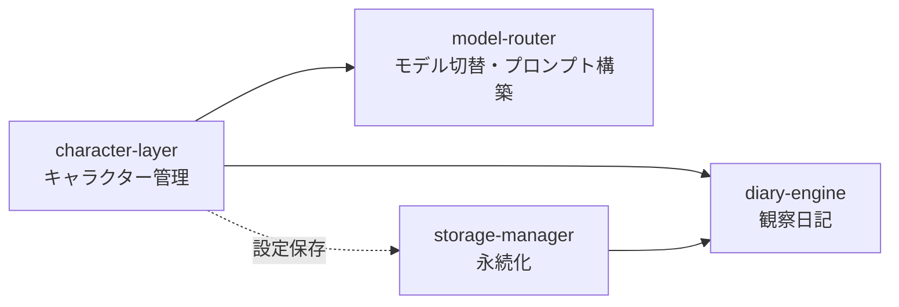

# structure.md — Mitatete 構造メモリ

> プロジェクトのディレクトリ構成・コンポーネント責務・依存方向・命名規約を定める。
> 技術スタックとアーキテクチャ図の正本は [`tech.md`](tech.md) を参照。

## ディレクトリ構成

正本は [`tech.md`](tech.md) の「Tauriアプリの構成」。要点のみ再掲する。

```
mitatete/
├── src-tauri/        # Rust バックエンド（APIキー管理・モデルルーター・ファイルI/O）
│   ├── src/          # main.rs / lib.rs / model_router.rs / key_manager.rs / storage.rs
│   ├── capabilities/ # Tauri v2 権限
│   ├── tauri.conf.json
│   └── Cargo.toml
├── index.html / character.html   # Vite エントリ（2ページ: main / character）
├── src/              # フロントエンド（TypeScript・vanilla）
│   ├── main.ts               # チャットUI
│   ├── character.ts          # キャラクター描画・独り言
│   ├── principles.ts         # 原則エンジン
│   ├── diary.ts              # 日記エンジン
│   └── styles.css
├── public/presets/   # プリセット定義（実行時アセット *.json）
├── dist/             # Vite ビルド成果（frontendDist・gitignore）
├── vite.config.ts / tsconfig.json / package.json
├── docs/             # コンセプトドキュメント
└── .kiro/            # ステアリング（steering/）・スペック（specs/）・設定（settings/）
```

## レイヤー境界

| レイヤー       | 場所             | 責務                                                          |
| -------------- | ---------------- | ------------------------------------------------------------- |
| フロントエンド | `src/`           | UI 表示・キャラクター描画・原則エンジン・日記表示             |
| バックエンド   | `src-tauri/src/` | APIキーのセキュア保存・モデルAPI呼び出し・ファイル/GDrive I/O |
| 境界           | Tauri コマンド   | フロント↔Rust は Tauri コマンド経由でのみ通信する             |

- APIキー・対話履歴・日記・設定のファイルI/Oはすべて Rust バックエンド経由で行い、フロントエンドから直接アクセスしない。
- APIキーはフロントエンド・ネットワーク側へ露出させない（[`tech.md`](tech.md) 「APIキー管理方針」）。

## コンポーネント責務と依存方向

スペックは依存順に実装する。



| スペック          | 責務                                                              | 依存                             |
| ----------------- | ----------------------------------------------------------------- | -------------------------------- |
| `character-layer` | プリセット／カスタムキャラクターを CharacterSchema に統一変換     | なし                             |
| `model-router`    | CharacterSchema＋原則値からプロンプト構築・Claude/GPT/Gemini 切替 | character-layer                  |
| `diary-engine`    | 原則9。対話履歴から AI 視点の観察日記を生成                       | character-layer・storage-manager |
| `storage-manager` | ローカル常時保存・Googleドライブ承認時同期                        | なし                             |

実装順序：character-layer → model-router → diary-engine（storage-manager は diary-engine 前に整備）。

## 命名・配置規約

| 種別                           | 配置                        | 形式                             |
| ------------------------------ | --------------------------- | -------------------------------- |
| プリセット定義                 | `src/assets/presets/`       | `*.json`（CharacterSchema 準拠） |
| 対話履歴（ローカル）           | `~/.mitatete/history/`      | `YYYY-MM-DD.json`（日別）        |
| AI観察日記（ローカル）         | `~/.mitatete/diary/`        | `YYYY-MM-DD.md`（日別）          |
| 設定                           | `~/.mitatete/settings.json` | キャラクター・原則設定           |
| カスタムキャラクター           | `~/.mitatete/characters/`   | キャラクター定義                 |
| 対話履歴・日記・設定（GDrive） | `mitatete/`（承認時のみ）   | ローカルと対応する構造           |

- ローカルファイルシステムは常時利用可能（承認状態に依存しない）。
- Googleドライブはユーザー承認時のみ同期し、承認取り消し時は既存クラウドデータに触れず、ローカルの OAuth トークンのみ削除する。

## 設計上の不変条件

- AIであることの明示（原則8）はすべての状態で維持する。
- キャラクター・原則設定の変更は常にユーザーの明示的操作によってのみ行う（システムによる自動変更・自動選択を禁止。[`tech.md`](tech.md) 「設計上の制約」参照）。
