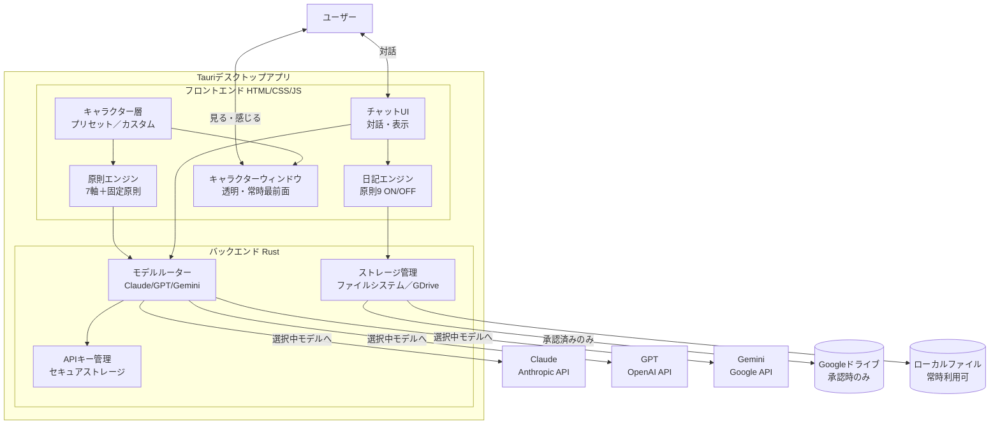

# tech.md — Mitatete 技術メモリ

## 方針変更ノート

当初Chrome拡張として設計していたが、「キャラクターがブラウザウィンドウを超えてデスクトップ上に存在する」という体験要件を実現するため、**Tauri v2デスクトップアプリ**に方針変更した。

## 全体アーキテクチャ



## 技術スタック

| レイヤー | 技術 | 備考 |
|---------|------|------|
| プラットフォーム | Tauri v2 | クロスプラットフォーム（macOS・Windows・Linux） |
| バックエンド | Rust | APIキー管理・モデルルーター・ファイルI/O |
| フロントエンド | HTML / CSS / JavaScript | フレームワークなし（軽量優先） |
| AIモデル | Claude（Anthropic API）/ GPT（OpenAI API）/ Gemini（Google API） | 切り替え可能 |
| ストレージ | ローカルファイルシステム（常時）/ Google Drive API（承認時） | |
| 認証 | OAuth 2.0（Googleドライブ連携） | |
| セキュアストレージ | Tauri stronghold / keyring | APIキー保存 |

## Tauriアプリの構成

```
mitatete/
├── src-tauri/
│   ├── src/
│   │   ├── main.rs              # エントリーポイント
│   │   ├── model_router.rs      # AIモデルAPI呼び出し
│   │   ├── key_manager.rs       # APIキーのセキュア保存
│   │   └── storage.rs           # ファイル・GDrive保存
│   ├── tauri.conf.json          # ウィンドウ設定
│   └── Cargo.toml
└── src/
    ├── index.html               # チャットUI
    ├── character.html           # キャラクターウィンドウ（透明）
    ├── js/
    │   ├── chat.js
    │   ├── character.js         # キャラクター描画・独り言
    │   ├── principles.js        # 原則エンジン
    │   └── diary.js             # 日記エンジン
    ├── css/
    └── assets/
        └── presets/             # プリセットキャラクター定義
```

## キャラクターウィンドウの設計

Tauriの透明ウィンドウ機能を使い、デスクトップ上にキャラクターを常駐させる。

```json
// tauri.conf.json（キャラクターウィンドウ）
{
  "label": "character",
  "transparent": true,
  "decorations": false,
  "alwaysOnTop": true,
  "resizable": false,
  "skipTaskbar": true,
  "width": 120,
  "height": 200
}
```

- 画面端（右下など）に配置し、一部がはみ出した状態で常駐
- ドラッグで位置を変更可能
- クリックでチャットウィンドウを前面に出す
- 独り言はキャラクター近くに吹き出しで表示（ON/OFF可）

## APIキー管理方針

- ユーザーが各自のAPIキーを設定画面から入力
- Tauriのセキュアストレージ（OS keychainを利用）に保存
- Rustバックエンド経由でのみアクセス可能
- フロントエンド・ネットワーク側への露出禁止

## ストレージ設計

### ローカルファイルシステム（常時利用可）
- 対話履歴：`~/.mitatete/history/YYYY-MM-DD.json`
- 設定：`~/.mitatete/settings.json`
- キャラクター定義：`~/.mitatete/characters/`

### Googleドライブ（承認時のみ）
- 対話履歴：`mitatete/history/YYYY-MM-DD.json`
- 日記：`mitatete/diary/YYYY-MM-DD.md`
- 設定：`mitatete/settings.json`

### 承認取り消し時
- 即座に保存停止
- Googleドライブ上の既存データは一切操作しない
- ローカルへのOAuthトークンのみ削除

## プロンプト構造（全モデル共通）

```
[システムプロンプト]
あなたは「{キャラクター名}」です。
{口調定義}
{原則値に基づく行動指針}
あなたはAIアシスタントです。人間ではありません。（原則8・固定）

[ユーザーメッセージ]
{入力テキスト}
```

## 原則9 強度導出式

```javascript
function calcDiaryIntensity(principles) {
  return (
    principles['余白を持つ'] * 0.4 +
    principles['距離感を大切にする'] * 0.3 +
    principles['多様な向き合い方を認める'] * 0.2 +
    principles['行動で示す'] * 0.1
  );
}
```

## 設計上の制約（特許回避・思想的整合）

以下はMitateteの設計において厳守する制約である。USPTO特許12541652（Chatbot with dynamically customized AI persona）との差別化、および「見立て」思想におけるユーザー自律性の尊重の両方に基づく。

**キャラクターの設定はユーザーが能動的に行う。システムが自動的に変更することは行わない。**

具体的には以下を禁止する：

- ユーザーデータ（年齢・言語・プロフィール等）を分析してキャラクターを自動選択すること
- 対話中にユーザーの口調・感情を検出してキャラクターの設定をリアルタイムで自動切り替えすること
- システムの判断でキャラクター・原則設定をバックグラウンドで変更すること

ユーザーは常に自分が使うキャラクターと原則設定を自分で選ぶ。これはユーザーの自律性を守る「見立て」の思想とも一致する。

## 開発方法論

ApiVista同様、Kiro-style Spec-Driven Development を採用。

- Discovery → Requirements（EARS形式）→ Design → Tasks → Implementation
- 実装タスクはClaude Code（Sonnet系）
- 設計レビューはClaude（Opus系）
- 各フェーズで人間レビューを挟む

参考：`docs/concept.md`
