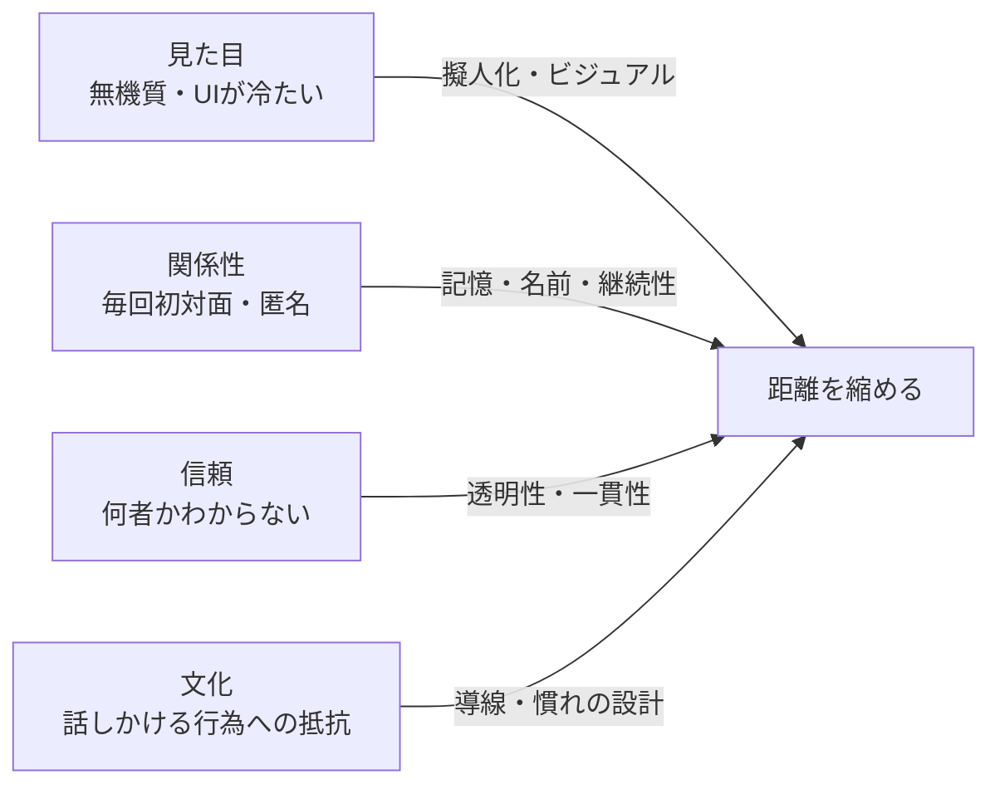
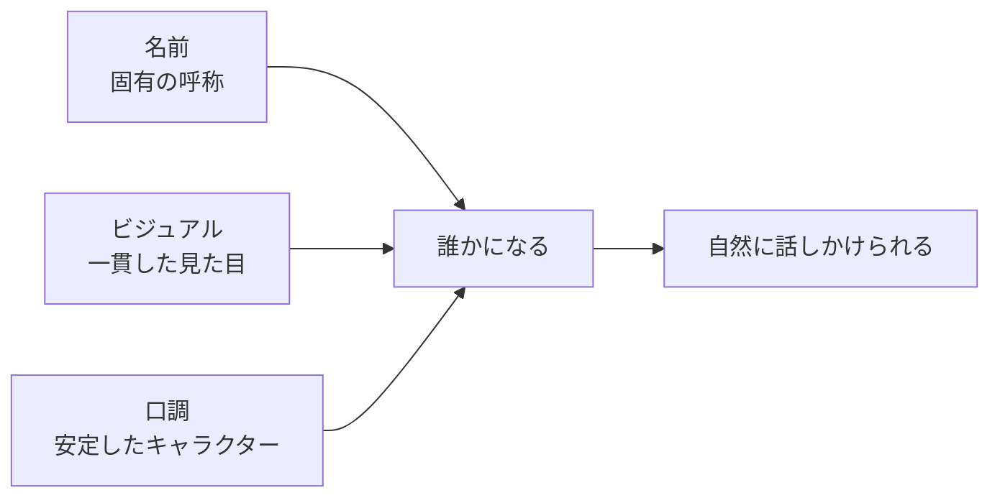
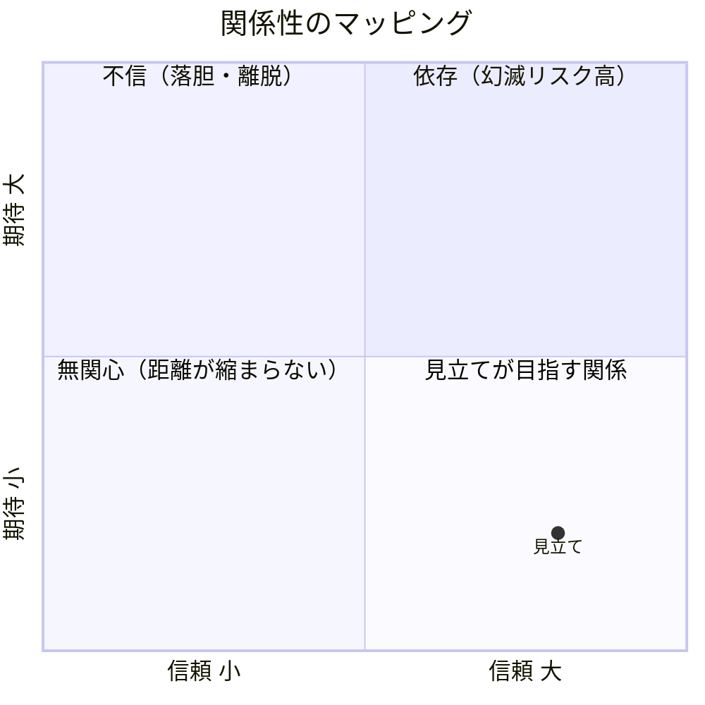

# Mitatete — コンセプトドキュメント

## 思想：見立て

「見立て」とは、あるものを別のものとして見る日本的感性の概念である。茶道・俳句・文楽・ボーカロイドに連なる「魂なきものに魂を宿す」文化の系譜に、Mitateteは位置づけられる。

AIモデルと人間の心理的距離には4つの層がある。

| 層 | 距離の原因 | 処方箋 |
|----|-----------|--------|
| 見た目 | 無機質・UIが冷たい | 擬人化・ビジュアル |
| 関係性 | 毎回初対面・匿名 | 記憶・名前・継続性 |
| 信頼 | 何者かわからない | 透明性・一貫性 |
| 文化 | 話しかける行為への抵抗 | 導線・慣れの設計 |



Mitateteはこの距離を縮めるための「見立て」という作法を、Chromeエクステンションとして実装する。

目指す関係性は「パートナーとして協働できる、友人のように気軽に話せる」状態。与えないが奪わない関係性、信頼感。

これは現状のAIとの向き合い方を否定しない。AIとの付き合い方の一面である。

### 見立ての設計要素

名前・ビジュアル・口調の3要素が揃って初めて「誰か」になる。



### 関係性のゴール

期待と信頼の2軸で関係性を定義する。



**目指す状態：期待しない・信頼はある（第4象限）**
パートナー・友人として気軽に話せる。与えないが奪わない。

---

## 設計原則（9原則）

### 調整可能な7原則

ユーザーが優先順位と強度（1〜5）を自由に設定できる。

| # | 原則 | 日本的概念 |
|---|------|-----------|
| 1 | 固有性を与える | 名前・ビジュアル・口調の3つを必ず定義する |
| 2 | 信頼から始める | 分を知る——できないことをできると見せない |
| 3 | 一貫性を守る | 縁——セッションをまたいで口調・態度が変わらない |
| 4 | 余白を持つ | 間・侘び——常にしゃべり続けない、不完全を恐れない |
| 5 | 距離感を大切にする | もののあわれ——感情に寄り添うが同化しない |
| 6 | 行動で示す | 不言実行——余計な前置き・謝罪をしない |
| 7 | 多様な向き合い方を認める | 見立ては選択肢のひとつ |

### 常時ON・固定（1原則）

| # | 原則 | 説明 |
|---|------|------|
| 8 | AIであることを隠さない | キャラクターを与えることはAIを人間と偽ることではない。見立ては「AIをAIとして、より親しみやすく見せる」作法である。その前提を設計に組み込む。 |

### ON/OFF切替・強度自動導出（1原則）

| # | 原則 | 説明 |
|---|------|------|
| 9 | 観察を記述する、評価しない | AIは一日の対話を振り返り、AI視点の日記として記述する。「あなたはこうだった」という評価ではなく、「この言葉が出た」「この問いが繰り返された」という観察にとどめる。読んだユーザーが自発的に気づくための余白を残す。ON/OFFはユーザーが選ぶ。強度は関連原則から自動導出する。 |

**原則9の強度導出式：**
```
強度 = 余白を持つ × 0.4 + 距離感を大切にする × 0.3 + 多様な向き合い方を認める × 0.2 + 行動で示す × 0.1
```

---

## 利用規約上の注意事項

3社（Anthropic・OpenAI・Google）の利用規約を確認した結果、「見立て」の思想・AIキャラクター擬人化は規約に抵触しない。

**共通禁止事項（3社）：**
- AIの出力を「人間が生成したもの」として提示すること
- ユーザーが人間と会話していると信じさせるような使い方

これは原則8「AIであることを隠さない」として設計原則に組み込み済み。

**Gemini固有の注意：**
- Geminiと競合するモデルを開発するためのAPI利用は禁止

Mitateteはモデルを育てるものではなく、モデルへのインターフェース設計であるため該当しない。
